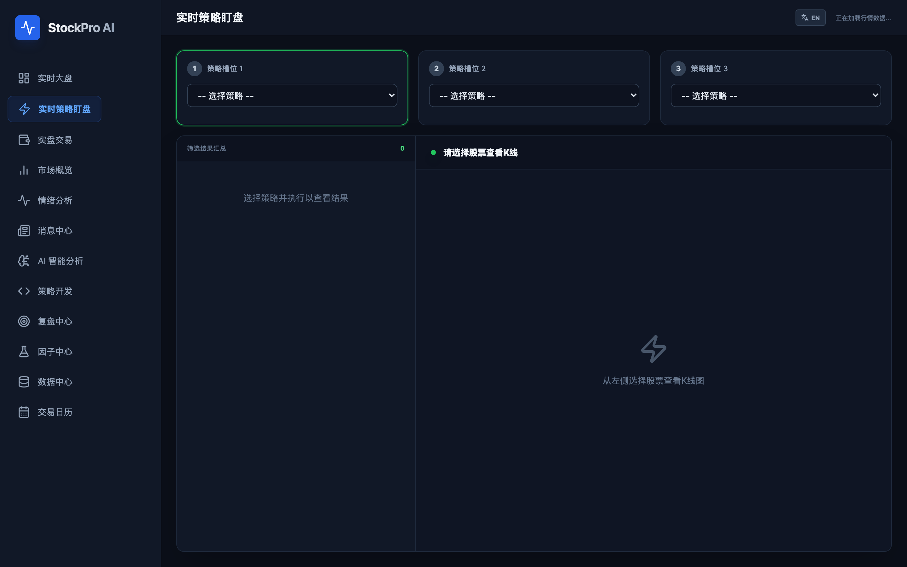
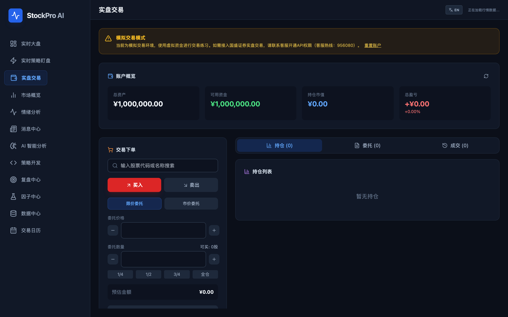
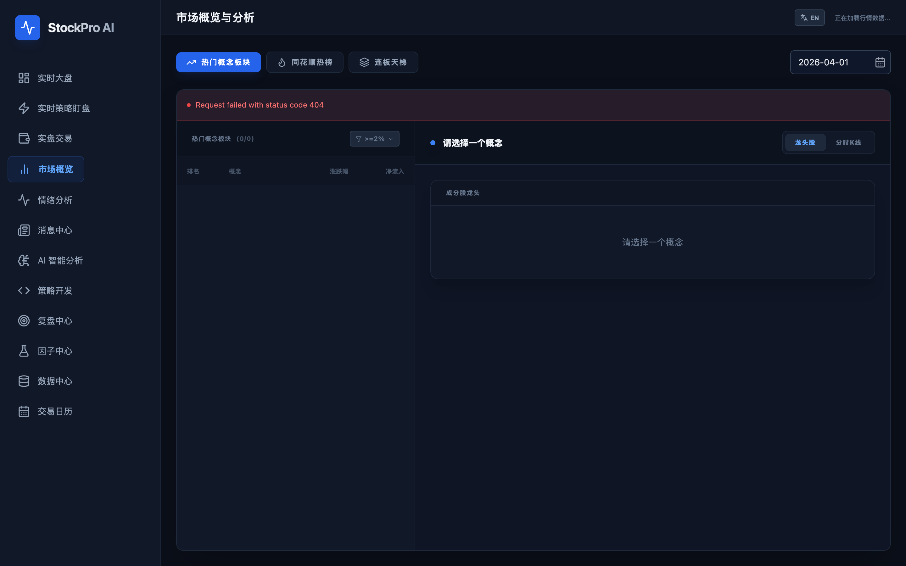
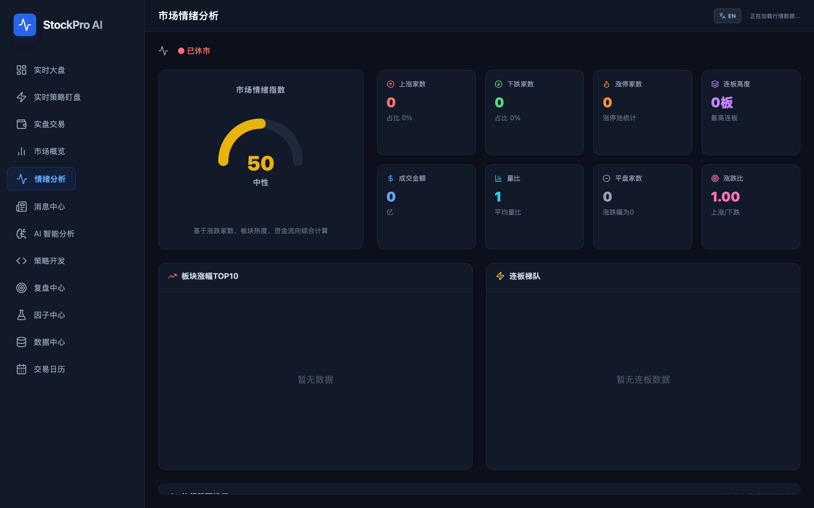
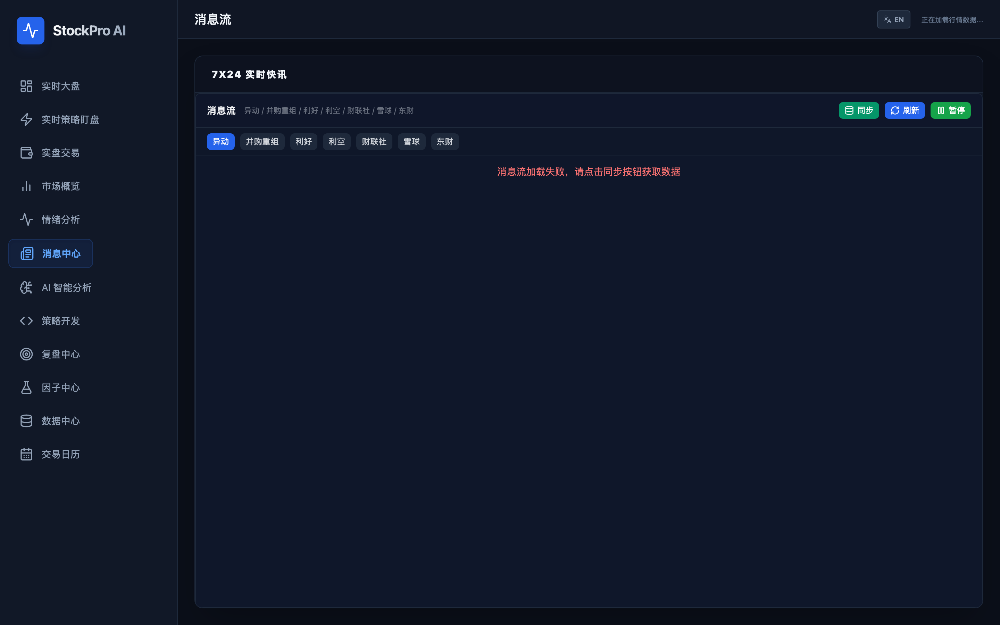
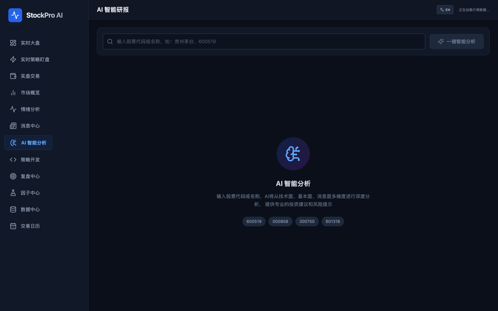
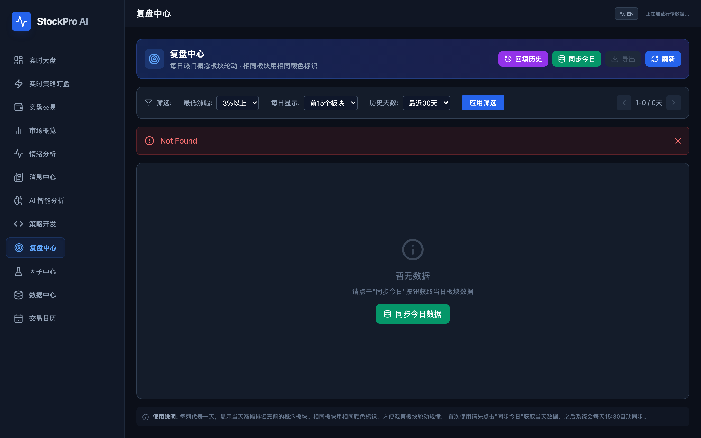
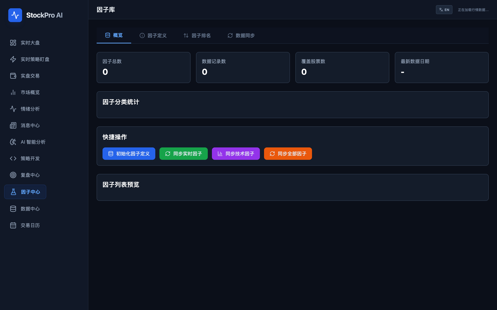
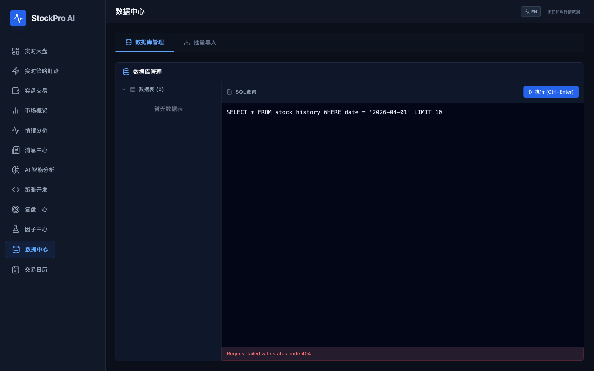
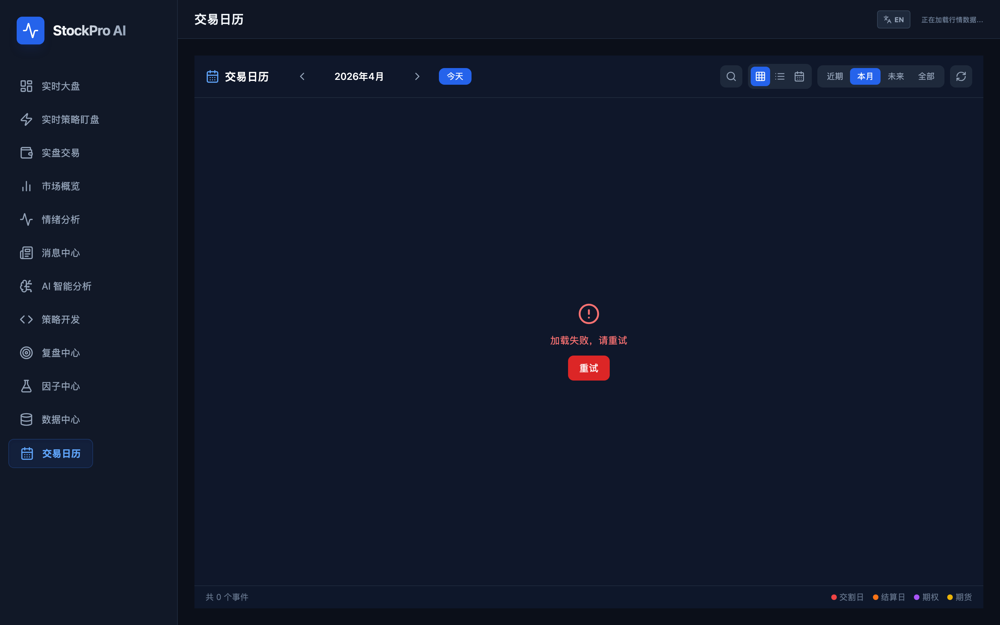

# StockPro AI - 智能股票分析系统

> A股实时行情监控、智能选股、AI分析一体化平台


---

## 功能模块

### 1. 实时大盘（首页看板）

首页聚合展示大盘指数、涨幅冠军板块、市场情绪、成交金额、异动预警等核心指标，并提供短线指标（连板梯队 / 短线强度）和热门板块实时监控，帮助用户一眼掌握全市场概貌。


### 2. 实时策略盯盘

支持同时挂载三个策略槽位，实时运行量化选股策略并展示筛选结果。左侧为命中股票列表，右侧为 K 线图表，便于快速验证策略信号。



### 3. 实盘交易

提供模拟 / 实盘交易下单界面，包含账户概览（总资产、可用资金、持仓市值、盈亏）、买入 / 卖出表单、限价 / 市价委托、持仓列表、委托记录和成交记录等完整交易闭环。



### 4. 市场概览

以热门概念板块、同花顺热榜、连板天梯三个维度分析板块轮动。支持按日期查看历史数据，点击概念可展开查看成分股龙头和分时 K 线。



### 5. 情绪分析

市场情绪量化仪表盘：情绪指数（0-100）、涨跌家数、涨停 / 跌停统计、连板高度、成交金额、量比、平盘家数、涨跌比等全维度数据，辅以板块涨幅 TOP10 和连板梯队分布图。



### 6. 消息中心

聚合 7×24 小时实时快讯，支持按异动 / 并购重组 / 利好 / 利空 / 财联社 / 雪球 / 东财等来源筛选，可一键同步、刷新或暂停。



### 7. AI 智能分析

输入股票代码或名称，由千问大模型从技术面、基本面、消息面多维度进行深度分析，输出专业投资建议和风险提示。内置常用股票快捷入口。



### 8. 策略开发

内置 Python 策略编辑器，可在线编写、测试和保存量化选股策略。预置放量突破等策略模板，支持自定义参数（观察周期、价格阈值、量比等），运行后直接查看选股结果。


### 9. 复盘中心

每日热门概念板块轮动复盘工具，以颜色标识相同板块的连续出现，支持按最低涨幅、每日展示数量、历史天数进行筛选，可回填历史数据并导出。



### 10. 因子中心

量化因子管理平台，支持因子定义、因子排名、数据同步四大功能。可一键初始化因子定义、同步实时因子和技术因子，查看因子总数、数据记录数和覆盖股票数等统计信息。



### 11. 数据中心

数据运维工具，包含数据库管理和批量导入两大功能。左侧展示数据表列表，右侧提供 SQL 查询编辑器，支持直接执行查询并查看结果。



### 12. 交易日历

交易日历视图，展示交割日、结算日、期权和期货等重要事件。支持月视图 / 列表视图切换，可按近期 / 未来 / 当月 / 全部进行筛选。



---

## 核心指标

### 短线指标

| 指标 | 说明 |
|------|------|
| 涨停数 | 当日涨停板股票数量 |
| 连板数 | 连续涨停2板及以上数量 |
| 最高板 | 当日最高连板数 |
| 跌停数 | 当日跌停板股票数量 |
| 炸板数 | 当日炸板股票数量 |
| 封板率 | 涨停成功率 = 涨停数/(涨停数+炸板数) |

### 数据缓存

- **市场指数**: 每10秒自动同步
- **全部股票**: 每30秒自动同步
- **热门概念**: 每2分钟自动同步
- **概念龙头股**: 5分钟本地缓存，查询更快

---

## 技术架构

```
Frontend (React + TypeScript + Vite)
          │
          ▼
Backend (FastAPI + Python 3.11)
          │
    ┌─────┴─────┐
    ▼           ▼
SQLite DB    AkShare API
(本地缓存)    (股票数据)
                │
                ▼
         千问大模型 API
         (AI 分析)
```

详细架构说明请参考 [技术架构文档](docs/technical_architecture.md)

---

## 快速开始

### 环境要求

- Python 3.11+
- Node.js 18+
- npm 或 yarn

### 1. 克隆项目

```bash
git clone https://github.com/your-username/StockPro.git
cd StockPro
```

### 2. 启动后端

```bash
cd backend
python -m venv venv
source venv/bin/activate  # Windows: venv\Scripts\activate
pip install -r requirements.txt

# 配置环境变量
cp .env.example .env
# 编辑 .env 文件，填入 QWEN_API_KEY

# 启动服务
uvicorn app.main:app --reload --port 8000
```

### 3. 启动前端

```bash
cd frontend
npm install
npm run dev
```

### 4. 访问应用

打开浏览器访问 http://localhost:5173

---

## 配置说明

### 后端环境变量 (backend/.env)

```bash
# AI 服务配置 (必填，用于AI分析功能)
QWEN_API_KEY=sk-xxxxxxxxxxxxxxxx
QWEN_STOCK_MODEL=qwen-plus

# 股票数据配置
AKSHARE_TIMEOUT=30

# CORS 配置
BACKEND_CORS_ORIGINS=["http://localhost:5173"]
```

### 前端环境变量 (frontend/.env)

```bash
VITE_API_URL=/api/v1
```

---

## 项目结构

```
StockPro/
├── backend/                    # 后端服务
│   ├── app/
│   │   ├── api/endpoints/      # API 端点
│   │   │   ├── market.py       # 市场数据 API
│   │   │   ├── stocks.py       # 股票筛选 API
│   │   │   ├── charts.py       # 图表数据 API
│   │   │   ├── ai.py           # AI 分析 API
│   │   │   └── ...
│   │   ├── services/           # 业务服务
│   │   │   ├── market_service.py
│   │   │   ├── realtime_sync_service.py  # 实时同步
│   │   │   ├── ai_service.py
│   │   │   └── ...
│   │   ├── db/
│   │   │   └── local_db.py     # 本地数据库
│   │   └── main.py             # 应用入口
│   └── requirements.txt
│
├── frontend/                   # 前端应用
│   ├── src/
│   │   ├── pages/              # 页面组件
│   │   │   ├── Home.tsx
│   │   │   ├── MarketOverview.tsx
│   │   │   ├── SentimentAnalysis.tsx
│   │   │   ├── AIStockAnalysis.tsx
│   │   │   └── ...
│   │   ├── components/         # 通用组件
│   │   ├── stores/             # 状态管理
│   │   ├── api/                # API 客户端
│   │   └── types/              # 类型定义
│   └── package.json
│
├── docs/                       # 文档
│   ├── technical_architecture.md  # 技术架构
│   ├── api.md                     # API 文档
│   └── modules/                   # 模块文档
│
└── README.md
```

---

## 文档

| 文档 | 说明 |
|------|------|
| [技术架构文档](docs/technical_architecture.md) | 系统架构、数据库设计、服务说明 |
| [API 接口文档](docs/api.md) | 完整的 API 接口说明 |
| [市场概览模块](docs/modules/market_overview.md) | 市场概览功能说明 |
| [AI 分析模块](docs/modules/ai_analysis.md) | AI 分析功能说明 |

---

## 数据库表说明

| 表名 | 用途 | 更新频率 |
|------|------|----------|
| `market_indices_realtime` | 大盘指数实时数据 | 10秒 |
| `short_line_indices_realtime` | 短线指标数据 | 10秒 |
| `all_stocks_realtime` | 全市场股票实时行情 | 30秒 |
| `hot_concepts_realtime` | 热门概念板块实时数据 | 2分钟 |
| `concept_leaders_cache` | 概念龙头股缓存 | 2分钟 |
| `ths_hot_realtime` | 同花顺热榜实时数据 | 2分钟 |
| `stock_history` | 股票日K线历史数据 | 按需 |
| `lianban_ladder_history` | 连板天梯历史数据 | 2分钟 |

完整表结构见 [技术架构文档](docs/technical_architecture.md#5-数据库设计)

---

## API 快速参考

```bash
# 市场概览
GET /api/v1/market/overview

# 短线指标
GET /api/v1/market/short-line-indices

# 热门概念
GET /api/v1/market/hot-concepts?limit=50

# 概念龙头股
GET /api/v1/market/hot-concept/leaders?name=BC电池&limit=20

# 日K线
GET /api/v1/charts/daily/600519

# AI分析
POST /api/v1/ai/analyze-stock
Body: {"symbol": "600519"}
```

完整 API 文档见 [api.md](docs/api.md)

---

## 常见问题

### Q: 短线指标没有数据？
A: 确保后端服务已启动，数据会在交易时段自动同步。非交易时段显示上一交易日数据。

### Q: 概念龙头股加载慢？
A: 首次查询会从 AkShare 获取数据并缓存到本地数据库，后续查询直接读取缓存，响应时间 <100ms。

### Q: AI 分析功能不可用？
A: 请检查 `backend/.env` 中的 `QWEN_API_KEY` 是否正确配置。

---

## 更新日志

### v2.0 (2026-01-24)
- 新增短线指标面板（涨停数、连板数、封板率等）
- 概念龙头股本地缓存，查询速度提升10倍
- 热门概念筛选增加 5%、8% 选项
- 优化数据同步服务，支持非交易时段展示历史数据
- 全面更新技术文档

### v1.0
- 基础功能实现

---

## 许可证

MIT License

---

## 贡献

欢迎提交 Issue 和 Pull Request！
