# StockPro AI

> A股智能投研平台 —— 实时行情、量化选股、AI 研报、策略盯盘、模拟交易一站式解决


---

## 功能模块

### 1. 总览看板

首页看板，聚合大盘指数（上证/深证/创业板/科创 50）、涨幅冠军板块、市场情绪指数、成交金额、异动预警等核心指标，搭配短线指标（连板梯队/短线强度）和热门板块实时监控，帮助用户一眼掌握全市场概貌。

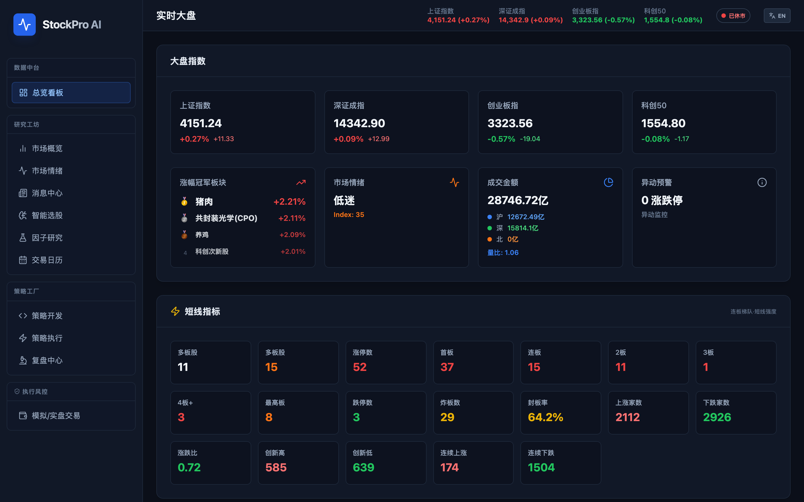

### 2. 市场概览

热门概念板块、同花顺热榜、连板天梯三维度板块轮动分析。支持按日期回看历史数据，点击概念可展开查看成分股龙头和分时 K 线。

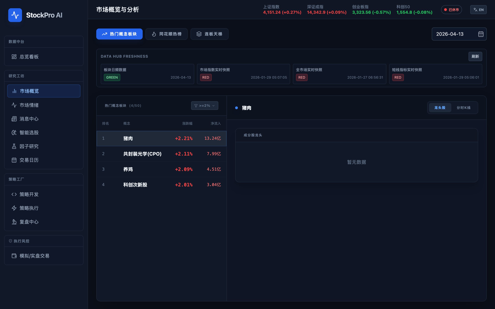

### 3. 市场情绪

市场情绪量化仪表盘：0-100 情绪指数、涨跌家数与比值、涨停/跌停/炸板统计、连板高度、成交金额、量比、平盘家数等全维度数据，辅以板块涨幅 TOP10 和连板梯队分布图。

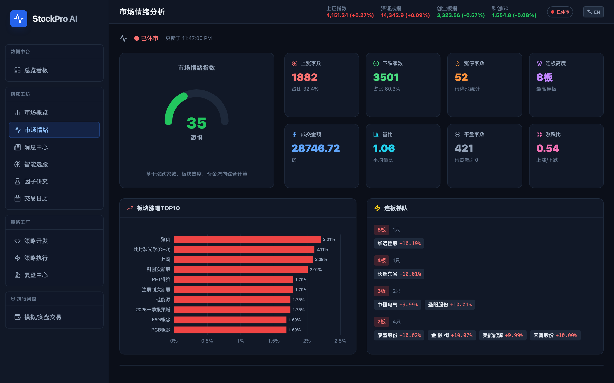

### 4. 消息中心

7×24 实时快讯聚合，支持按异动/并购重组/利好/利空/财联社/雪球/东财等来源标签筛选，可一键同步、刷新或暂停推送。

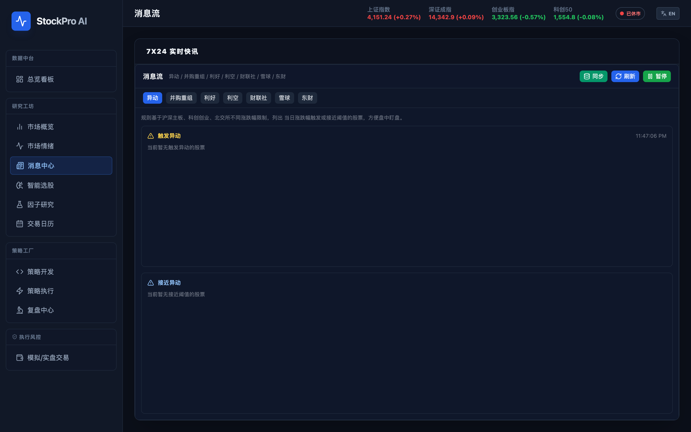

### 5. 智能选股

输入股票代码或名称，由千问大模型从技术面、基本面、消息面多维度进行深度分析，输出专业投资建议和风险提示。内置常用股票快捷入口。

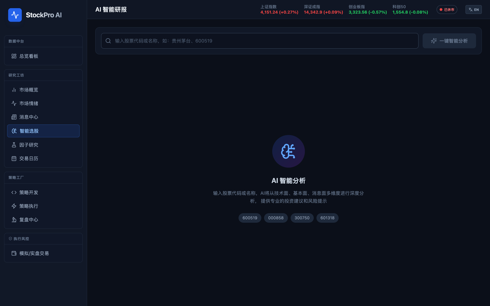

### 6. 因子研究

量化因子管理平台，包含因子概览、因子定义、因子排名、数据同步四大功能标签页。支持一键初始化因子、同步实时/技术因子，并展示因子总数、数据记录数、覆盖股票数等统计。

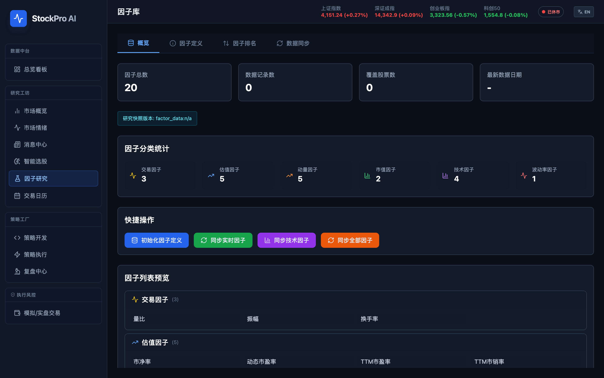

### 7. 交易日历

交割日、结算日、期权、期货等交易事件日历。支持月视图/列表视图切换，可按近期/未来/当月/全部筛选事件。

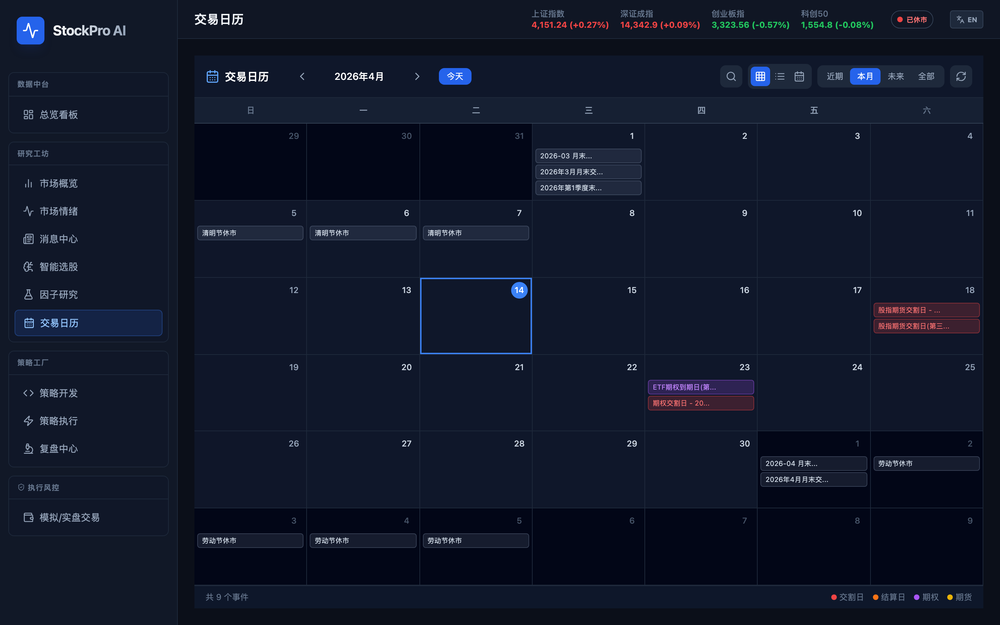

### 8. 策略开发

内置 Python 策略编辑器（Monaco Editor），可在线编写、测试和保存量化选股策略。预置放量突破等策略模板，支持自定义参数，运行后直接查看选股结果。

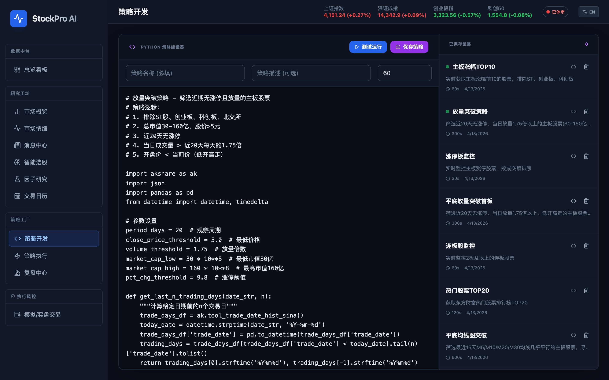

### 9. 策略执行

支持同时挂载三个策略槽位，实时运行量化选股策略并展示筛选结果。左侧为命中股票列表，右侧联动 K 线图表，便于快速验证策略信号。

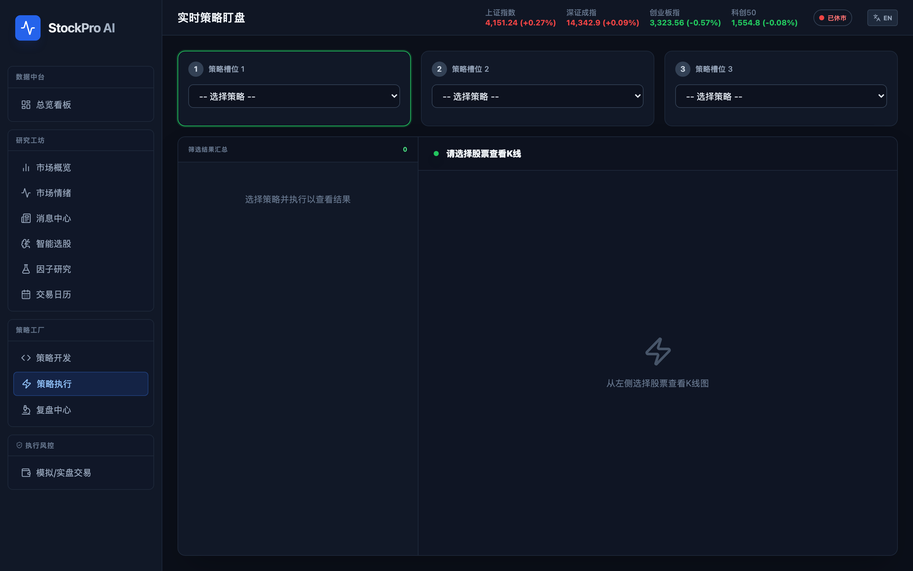

### 10. 复盘中心

每日热门概念板块轮动复盘工具。以颜色标识相同板块的连续轮动，支持按最低涨幅、每日展示数量、历史天数进行筛选，可回填历史数据并导出。

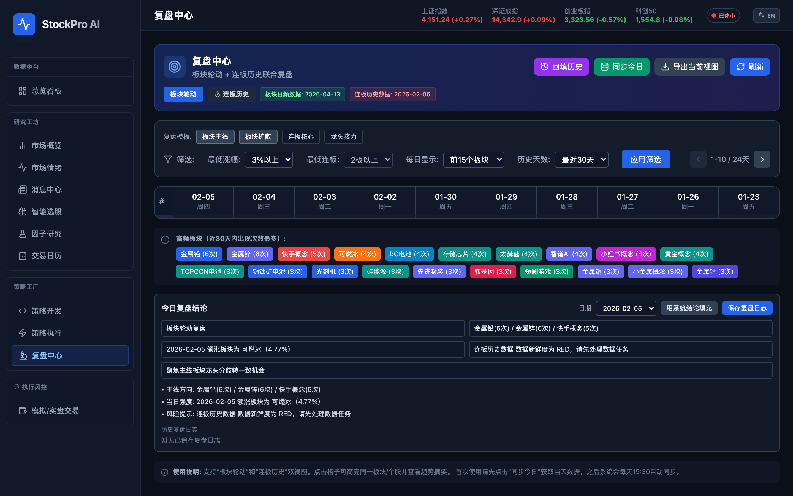

### 11. 模拟/实盘交易

模拟与实盘交易下单界面，包含账户概览（总资产、可用资金、持仓市值、盈亏）、买入/卖出下单、限价/市价委托切换，以及持仓、委托、成交三大记录面板。

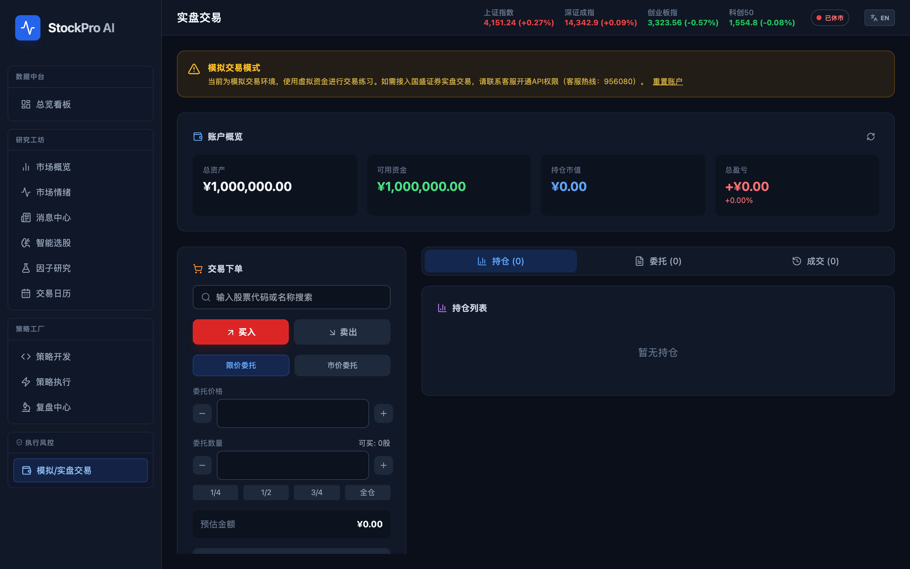

---

## 策略库

项目内置 7 个量化选股策略，存放在 [`strategies/`](strategies/) 目录：

| 策略 | 说明 | 执行间隔 |
|------|------|---------|
| 主板涨幅TOP10 | 实时获取主板涨幅前10股票 | 60s |
| 放量突破策略 | 近20天无涨停 + 当日放量1.75倍的主板股 | 300s |
| 涨停板监控 | 主板涨停股票，按成交额排序 | 30s |
| 平底放量突破首板 | 放量突破 + 低开高走，适合做首板 | 300s |
| 连板股监控 | 2板及以上的连板股票 | 60s |
| 热门股票TOP20 | 东方财富热门股票排行榜 | 120s |
| 平底均线图突破 | MA5/10/20/30四线粘合后的突破机会 | 600s |

在新设备上克隆项目后，策略会在后端启动时自动导入。也可手动运行：

```bash
python scripts/init_strategies.py          # 仅导入缺失的策略
python scripts/init_strategies.py --force   # 覆盖已有同名策略
```

策略脚本规范和自定义方法详见 [strategies/README.md](strategies/README.md)。

---

## 技术架构

```
┌─────────────────────────────────────────────────────┐
│              Frontend (React 18 + Vite 6)           │
│  TypeScript · TailwindCSS · Zustand · ECharts       │
│  Monaco Editor · React Router 7 · Electron (可选)    │
└──────────────────────┬──────────────────────────────┘
                       │ /api proxy
┌──────────────────────▼──────────────────────────────┐
│             Backend (FastAPI + Python 3.11)          │
│  AkShare · DashScope · APScheduler · Backtrader     │
│                                                      │
│  ┌─────────────┐  ┌──────────────┐  ┌────────────┐ │
│  │ RealtimeSync │  │  Scheduler   │  │  Strategy  │ │
│  │  Service     │  │  Service     │  │  Executor  │ │
│  └──────┬──────┘  └──────┬───────┘  └─────┬──────┘ │
│         │                │                 │         │
│  ┌──────▼────────────────▼─────────────────▼──────┐ │
│  │              SQLite (本地持久化)                  │ │
│  └────────────────────────────────────────────────┘ │
└──────────────────────┬──────────────────────────────┘
                       │
          ┌────────────┼────────────┐
          ▼            ▼            ▼
      AkShare     千问大模型     Supabase
     (行情数据)   (AI 分析)    (云端存储)
```

### 数据同步

| 数据类型 | 同步频率 | 说明 |
|---------|---------|------|
| 大盘指数 | 10 秒 | 上证、深证、创业板等核心指数 |
| 全市场股票 | 30 秒 | 全 A 股实时行情快照 |
| 热门概念 | 2 分钟 | 概念板块涨幅排名 |
| 概念龙头股 | 5 分钟缓存 | 板块内龙头股明细 |
| 连板天梯 | 2 分钟 | 连板股票梯队分布 |

---

## 快速开始

### 环境要求

- Python 3.11+
- Node.js 18+
- npm

### 1. 克隆项目

```bash
git clone https://github.com/Shadowell/StockPro.git
cd StockPro
```

### 2. 启动后端

```bash
cd backend
python -m venv venv
source venv/bin/activate  # Windows: venv\Scripts\activate
pip install -r requirements.txt

# 创建环境变量文件（按需填写）
cat > .env << 'EOF'
QWEN_API_KEY=your-qwen-api-key
QWEN_STOCK_MODEL=qwen-plus
AKSHARE_TIMEOUT=30
BACKEND_CORS_ORIGINS=["http://localhost:9999"]
EOF

uvicorn app.main:app --reload --port 8000
```

### 3. 启动前端

```bash
cd frontend
npm install
npm run dev
```

### 4. 访问应用

打开浏览器访问 http://localhost:9999

---

## 环境变量

### 后端 (`backend/.env`)

| 变量 | 必填 | 默认值 | 说明 |
|------|------|--------|------|
| `QWEN_API_KEY` | 是（AI 分析） | `""` | 通义千问 API Key |
| `QWEN_STOCK_MODEL` | 否 | `qwen-plus` | AI 分析使用的模型 |
| `AKSHARE_TIMEOUT` | 否 | `30` | AkShare 请求超时（秒） |
| `BACKEND_CORS_ORIGINS` | 否 | `[]` | 允许的跨域来源 |
| `SUPABASE_URL` | 否 | `""` | Supabase 项目 URL |
| `SUPABASE_KEY` | 否 | `""` | Supabase anon key |
| `ENABLE_SCHEDULER` | 否 | `true` | 启用定时任务调度 |
| `ENABLE_REALTIME_SYNC` | 否 | `true` | 启用实时数据同步 |
| `ENABLE_STRATEGY_EXECUTION` | 否 | `true` | 启用策略执行引擎 |
| `DB_MODE` | 否 | `local` | 数据库模式 |

### 前端 (`frontend/.env`)

| 变量 | 默认值 | 说明 |
|------|--------|------|
| `VITE_API_URL` | `/api/v1` | 后端 API 基础路径 |
| `VITE_DEV_API_PROXY_TARGET` | `http://127.0.0.1:8000` | 开发代理目标地址 |

---

## 项目结构

```
StockPro/
├── backend/
│   ├── app/
│   │   ├── main.py                  # FastAPI 入口、生命周期、中间件
│   │   ├── core/config.py           # 配置与环境变量
│   │   ├── api/
│   │   │   ├── api.py               # 路由注册
│   │   │   └── endpoints/           # 16 个 API 模块
│   │   ├── services/                # 18 个业务服务
│   │   └── db/local_db.py           # SQLite 本地数据库
│   └── requirements.txt
│
├── frontend/
│   ├── src/
│   │   ├── App.tsx                  # 路由与懒加载
│   │   ├── pages/                   # 14 个页面组件
│   │   ├── components/              # 通用 UI 组件
│   │   ├── stores/                  # Zustand 状态管理
│   │   ├── api/client.ts            # Axios API 客户端
│   │   └── types/                   # TypeScript 类型定义
│   └── package.json
│
├── docs/                            # 技术文档
│   ├── technical_architecture.md
│   ├── api.md
│   ├── DATA_ARCHITECTURE.md
│   └── screenshots/                 # 模块截图
│
└── scripts/                         # 运维脚本
```

---

## API 参考

后端运行后可访问 http://localhost:8000/docs 查看完整的 Swagger 文档。

```bash
# 市场概览
GET  /api/v1/market/overview

# 短线指标
GET  /api/v1/market/short-line-indices

# 热门概念
GET  /api/v1/market/hot-concepts?limit=50

# 概念龙头股
GET  /api/v1/market/hot-concept/leaders?name=BC电池&limit=20

# 日 K 线
GET  /api/v1/charts/daily/600519

# AI 分析
POST /api/v1/ai/analyze-stock
Body: {"symbol": "600519"}
```

---

## 常见问题

**Q: 短线指标没有数据？**
确保后端服务已启动且处于交易时段。非交易时段会展示上一交易日数据。

**Q: 概念龙头股加载慢？**
首次查询从 AkShare 远程拉取并缓存到本地 SQLite，后续查询直接读取缓存（<100ms）。

**Q: AI 分析功能不可用？**
检查 `backend/.env` 中的 `QWEN_API_KEY` 是否正确配置。

**Q: 前端端口是多少？**
开发服务器默认端口为 `9999`（在 `vite.config.ts` 中配置）。

---

## 许可证

MIT License

---

## 贡献

欢迎提交 Issue 和 Pull Request！
