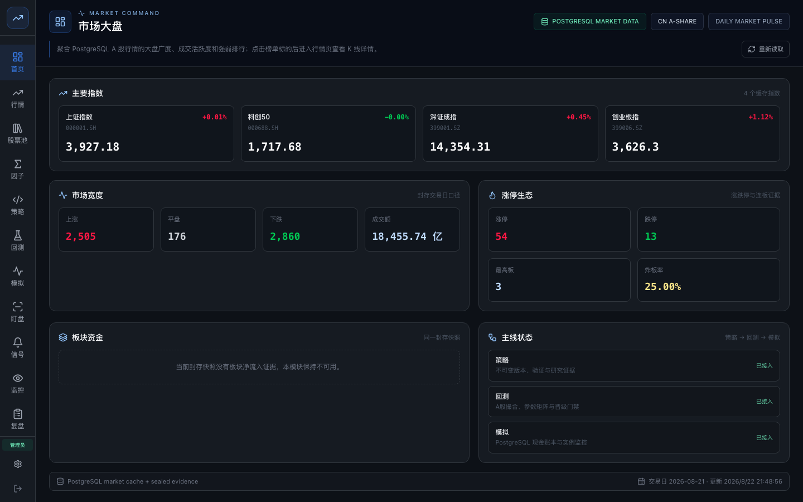

# StockPro

StockPro 是一个面向 A 股研究与策略验证的量化工作台。它把市场研究、因子、股票池、Python 策略、回测、模拟交易、盯盘、运行监控和每日复盘放进一条可追溯的工作流。

StockPro 的重点不是“给出一只必涨股票”，而是让每个研究结论都能回答：用了哪一天的数据、来自哪个数据源、绑定了哪个快照和策略版本、经过了哪些验证、最终如何形成信号与模拟成交。

> **交付边界**：研究优先，仅模拟交易（Paper）。不开放真实券商下单；期货仅作隐藏预留。生产环境由 GitHub Actions 从 `main` 自动部署。

[English](README.en.md) · [文档中心](docs/index.md) · [产品规格](docs/spec.md) · [API 指南](docs/api.md)



> 截图中的账户、订单、成交、持仓和收益均来自隔离的 Paper 模拟账本，不代表真实交易或未来收益。

## 快速开始

> 动手前先确认所在目录是产品树：`git worktree list && git branch --show-current`。详见下方[仓库布局](#仓库布局产品树与设计分支)。

### 环境要求

- macOS 或 Linux
- Python 3.11+、Node.js 18+、npm 9+
- Docker Compose：用于一键创建本地隔离库（黄金路径必需）
- 可选：tmux（让一键启动的服务稳定驻留）；数据库服务器 SSH 别名（仅在需要连服务器研究库时）

### 首次初始化

```bash
git clone https://github.com/Shadowell/StockPro.git
cd StockPro

cp backend/.env.example backend/.env
# 编辑 backend/.env：至少修改管理员密码和 Token 密钥；
# 需要真实数据或 AI 时，再填写 TUSHARE_TOKEN / QWEN_API_KEY。

./scripts/setup_isolation_db.sh                                  # 一键创建隔离库 stockpro_bitpro_rebase_dev
./scripts/setup_isolation_db.sh --migrate                        # 应用 PostgreSQL 迁移

python3 -m venv backend/venv
backend/venv/bin/python -m pip install -r backend/requirements.txt
npm --prefix frontend install
./start.sh --check                                               # 核对依赖与本地隔离库
./start.sh                                                       # 启动前后端并做健康检查
./scripts/backup_local_data.sh                                   # 保存一份可校验的本地数据备份
```

启动后打开：

- Web：`http://localhost:4444`
- 后端健康检查：`http://localhost:4445/api/health`
- OpenAPI：`http://localhost:4445/docs`

管理员认证取自 `backend/.env` 的 `BITPRO_ADMIN_USERNAME`、Argon2
`BITPRO_ADMIN_PASSWORD_HASH` 与 `BITPRO_AUTH_TOKEN_SECRET`；生产 HTTPS 还必须开启
`BITPRO_AUTH_ENABLED` 和 `BITPRO_AUTH_COOKIE_SECURE`。不要把明文密码、真实密钥或 `.env` 提交到 Git。

### 日常运行

```bash
./start.sh               # 只连接本地隔离库并启动前后端
./status.sh              # 查看进程、健康、数据库、日线数量和最新备份
./restart.sh             # 停止后重新启动，不安装依赖、不打开 SSH 隧道
./stop.sh                # 停止本地前后端，保留数据库和备份
./scripts/backup_local_data.sh
tail -f logs/backend.log logs/frontend.log
```

`start.sh` / `restart.sh` 只接受本机隔离库 `stockpro_bitpro_rebase_dev`：优先 Docker
`127.0.0.1:55432`，其次同名 Unix socket。它们拒绝远程 host、不继承环境里的 `DATABASE_URL`、
不建立 SSH 隧道、不安装依赖、不部署远程服务器。迁移或恢复 Paper 时显式执行：

```bash
(cd backend && venv/bin/python bootstrap_runtime.py)              # 迁移 + 目录 + 预置策略
(cd backend && venv/bin/python bootstrap_runtime.py --recover-paper)   # 恢复中断的 Paper 证据
```

### 验证

```bash
export DATABASE_URL="$(./scripts/setup_isolation_db.sh --print-url)"
./scripts/check.sh        # 前端 tsc/lint/build + 后端 pytest + Python 编译
```

`check.sh` 只接受指向隔离库 `stockpro_bitpro_rebase_dev` 的 `DATABASE_URL`；缺失或不隔离时会退出并打印上面的命令。真实后端 E2E 另需本地服务可用：`npm --prefix frontend run test:e2e:real`。

安装、日志、排障和生产部署细节见[本地运行手册](docs/deployment.md)。

## StockPro 能做什么

### 市场研究

- 主要指数、市场宽度、成交额、涨跌停、炸板、连板梯队与市场情绪。
- 概念和行业板块、资金流、热门股票、新闻事件与交易日历。
- 个股研究联动日线、分时、盘口、基本面和 AI 分析。
- 明确展示交易日、数据来源、采集时间、新鲜度和缺失原因，不把过期数据伪装成实时数据。

### 因子与股票池

- 因子定义、代码版本、计算记录、因子值与不可变因子快照。
- 单因子、多因子、相关性、覆盖率和有效性分析。
- 内置 100 个参考因子目录；实际可计算、已发布的因子以页面状态和 PostgreSQL 记录为准。
- 规则生成股票池，记录入选原因，封存为可复现的快照。

### 策略与回测

- 浏览器内编写普通 Python 策略，保存不可变策略版本。
- 绑定数据、因子、股票池、研究协议和成本模型后提交异步回测。
- 收益、基准、回撤、风险指标、月度表现、持仓、订单、成交、日志与参数证据。
- A 股约束内建：交易日历、T+1、100 股整数手、涨跌停、停牌、手续费与印花税。

### 模拟执行与复盘

- 把验证后的策略版本晋级到隔离的 Paper 实例。
- 审计信号、风控决策、委托、成交、持仓、现金、权益曲线、心跳和运行周期。
- “盯盘”观察业务信号，“监控”查看运行与数据健康。
- 收盘后记录市场结论、风险事项和次日计划，形成每日复盘。

### 数据与 AI

- PostgreSQL 统一管理证券主数据、中文简称、交易日历、行情、估值、停复牌、涨跌停、因子、回测和模拟盘证据。
- TuShare 为主要研究数据源；AKShare 仅作明确标注的补充或整类回退，禁止静默混源。
- 每日同步覆盖全量 A 股证券主数据、最近开放交易日日线与 `daily_basic`；近半年历史同步同时物化沪深300基准、行业对照、market evidence snapshot 和异动 metrics。
- AI 研发用于个股与研究对象分析；未配置通义千问密钥时只提供明确的不可用状态，不伪造模型结果。
- 本地 `stockpro-mcp-v1` Agent 接口：哈希 Token、读写作用域、幂等键和审计记录。

## 13 个一级工作区

操作台以“策略 → 回测 → 模拟”为唯一执行主线，其余为研究与运行辅助。旧版 `/pools`、`/factors`、`/paper` 保留为兼容重定向，不作为最终截图或验收入口。

| 工作区 | 路由 | 主要用途 | 页面合同 |
| --- | --- | --- | --- |
| 首页 | `/` | 市场总览 | [首页](docs/pages/首页.md) |
| 行情 | `/market` | 市场结构、情绪、事件、日历与个股研究 | [行情](docs/pages/行情.md) |
| 股票池/价差 | `/arbitrage` | 规则、生成记录、快照与回测衔接 | [股票池](docs/pages/股票池.md) |
| 因子 | `/factorlab` | 因子目录、计算、分析、相关性与因子值 | [因子库](docs/pages/因子库.md) |
| 策略 | `/strategy` | 策略目录、代码、参数、版本和验证 | [策略中心](docs/pages/策略中心.md) |
| 回测 | `/backtest` | 异步任务、实验结果和完整证据 | [回测](docs/pages/回测.md) |
| 模拟 | `/live` | Paper 实例、模拟订单、成交、持仓与风控 | [模拟盘](docs/pages/模拟盘.md) |
| 盯盘 | `/watch` | 信号与执行证据的人工观察面 | [盯盘](docs/pages/盯盘.md) |
| 信号 | `/signals` | 信号 payload、Paper lineage 与投递审计 | [信号中心](docs/pages/信号中心.md) |
| 监控 | `/monitor` | 策略、数据、风险与通知健康状态 | [监控](docs/pages/监控.md) |
| 复盘 | `/review` | 当日市场结论、风险与次日计划 | [复盘中心](docs/pages/复盘中心.md) |
| 数据 | `/data` | 数据集、同步、质量、Provider 和调度 | [数据中心](docs/pages/数据中心.md) |
| AI 研发 | `/ai-lab` | AI 研究任务、对象分析与证据绑定 | [人工智能研发](docs/pages/人工智能研发.md) |

管理登录入口为 `/admin-login`，登录门禁行为见[登录门禁](docs/pages/登录门禁.md)。市场情绪、新闻、日历等旧入口跳转到对应工作区的二级页面。

## 研究到模拟执行的完整链路

```text
数据同步与质量检查 → 封存数据快照 → 因子快照 → 股票池快照
        → 不可变策略版本 → 异步回测与证据评审 → Paper 模拟执行
        → 盯盘 / 监控 / 每日复盘
```

因子、股票池、回测和 Paper 运行均绑定显式版本或快照。回测期间不调用外部行情 Provider，也不会用新数据覆盖已封存的研究证据。

## 技术架构

| 层 | 技术 | 地址 |
| --- | --- | --- |
| 前端 | React 18、TypeScript、Vite、Tailwind CSS、ECharts | `http://localhost:4444` |
| 后端 | FastAPI、Pydantic、SQLAlchemy、APScheduler、Backtrader | `http://localhost:4445` |
| 数据库 | PostgreSQL | 本地隔离库 `stockpro_bitpro_rebase_dev`（本机 socket 或 Docker `127.0.0.1:55432`） |
| 数据源 | TuShare 优先，AKShare 显式补充 | 由数据中心管理 |
| AI | 通义千问 / DashScope，可选 | 由 `QWEN_API_KEY` 启用 |
| Agent | 本地 stdio MCP，协议 `stockpro-mcp-v1` | 不提供公网传输 |

运行 API 边界：健康检查与 Web 鉴权主入口为 `/api/health`、`/api/health/storage` 和
`/api/auth/*`；当前业务域为 `/api/v2/*`，完整字段以 `/api/openapi.json` 为准。

前端采用紧凑的金融操作台风格：固定一级菜单、页面内二级标签、统一状态语义、中文优先，支持切换“红涨绿跌 / 绿涨红跌”。

## 配置原则

从 `backend/.env.example` 创建本地配置。关键开关：

| 配置 | 作用 | 建议 |
| --- | --- | --- |
| `STOCKPRO_LOCAL_DATABASE_URL` | 本地服务 PostgreSQL 连接 | 可选；只能指向 `stockpro_bitpro_rebase_dev` |
| `DATABASE_URL` | 显式脚本/后端命令的 PostgreSQL 连接 | 不要指向 `stockpro_dev` 或生产库运行本地服务 |
| `DATABASE_SSH_HOST` | 数据库服务器 SSH 主机别名 | 仅连服务器研究库时需要，勿交给 `check.sh` |
| `TUSHARE_TOKEN` | TuShare 数据权限 | 按实际积分和接口权限配置 |
| `QWEN_API_KEY` | 通义千问分析 | 不使用 AI 时留空 |
| `ENABLE_SCHEDULER` | 日终调度 | 理解任务范围后再启用 |
| `ENABLE_REALTIME_SYNC` | 实时轮询 | 默认关闭，避免启动即访问外部源 |
| `ENABLE_STRATEGY_EXECUTION` | 策略定时执行 | 默认关闭，按需显式启用 |
| `ENABLE_EXTERNAL_MARKET_FETCH` | 页面读取时外部取数 | 建议关闭，优先读取已持久化数据 |
| `RUN_*_ON_STARTUP` | 启动期写操作 | 默认关闭，初始化和恢复均显式执行 |

数据同步会产生外部 API 调用与数据库写入。先在数据中心确认数据日期、权限、覆盖范围和预计任务量，再执行全市场同步。

## 仓库布局：产品树与设计分支

- **产品树**：当前主线开发、验证和 GitHub Actions 部署以 `/Users/jie.feng/Dev/Github/Private/StockPro` 的 `main` 及其新建 `codex/*` 分支为准。
- **历史 worktree / 设计分支**：`StockPro-bitpro-a-share`、`codex/bitpro-a-share-rebuild-design` 等仅作历史迁移或设计参考；继续使用前必须先核对是否已合入当前 `main`。
- 开始工作前先确认所在树：`git worktree list`、`git branch --show-current` 和 `git status --short`。若不在当前产品树或 `main` 派生的新分支上，先切换再动手。

## 安全与使用边界

- StockPro 是研究和模拟验证工具，不构成投资建议。
- 当前没有真实券商下单入口；Paper 模拟结果不代表真实可成交结果。
- AI 输出必须结合数据日期、来源和模型可用状态人工复核。
- 不提交 `.env`、数据库、备份、日志、浏览器产物、私钥、API Token 或券商凭证。
- GitHub push 只交付源码；服务器变更必须由用户在当前会话中明确授权。

## 文档导航

| 文档 | 内容 |
| --- | --- |
| [文档中心](docs/index.md) | 全部文档的统一入口 |
| [产品规格](docs/spec.md) | 产品边界、核心对象、工作流与验收规则 |
| [用户指南](docs/user_guide.md) | 按页面走完研究到模拟盘流程 |
| [API 指南](docs/api.md) | 鉴权、接口域、写操作边界与 OpenAPI |
| [技术架构](docs/technical_architecture.md) | 系统组件与运行边界 |
| [数据架构](docs/DATA_ARCHITECTURE.md) | Provider、快照、质量、来源与调度 |
| [本地运行手册](docs/deployment.md) | 安装、隔离库、启动、日志、排障与生产部署 |
| [策略中心页面合同](docs/pages/策略中心.md) | 策略脚本约定、预置策略、版本规则与验证边界 |
| [本地运行手册](docs/deployment.md) | restart / stop / check / setup 入口与部署边界 |
| [开发进度](docs/progress.md) | 实现与验证历史 |
| [Sprint 合同](docs/contracts/) | 迭代范围与验收记录；入口见 [contracts/active.md](docs/contracts/active.md) |
| [历史归档](docs/archive/) | Electron/优化总结等早期材料 |

## License

StockPro 源代码采用 [MIT License](LICENSE)。

MIT 协议只覆盖本仓库拥有授权的源代码和文档。市场数据、AI 服务、第三方接口、依赖库及其输出仍受各自许可证、服务条款、数据授权、调用频率和再分发规则约束。
