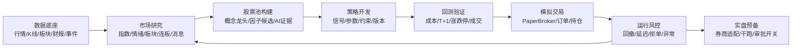

# StockPro A-Share Research Roadmap

Date: 2026-06-26

## Product North Star

StockPro should behave like a professional A-share research workstation, not a generic market dashboard. The core loop is:

## Phase 0: Page Readiness Contract

Goal: every page opens, has a clear purpose, exposes data readiness, and does not degrade into a generic admin screen.

- Keep `primary pages expose usable A-share research workflow anchors` as the route-level smoke test.
- Add route error-state checks for `/market`, `/ai`, `/factors`, `/data`, and `/paper`.
- Add page readiness metadata: `source`, `lastUpdated`, `freshness`, `blockingIssues`.
- Mark hidden routes as either maintained or redirected.

Exit criteria:

- All protected pages render in mocked E2E with no page errors.
- Every primary page has at least one visible A-share workflow anchor.
- Every data-driven page shows freshness or an actionable empty state.

## Phase 1: Data Foundation

Goal: make research pages trustworthy by showing what data is available, fresh, missing, or stale.

- Define dataset SLAs for `market_indices_realtime`, `all_stocks_realtime`, `short_line_indices_realtime`, `daily_concept_sectors`, `kline_history`, `stock_fundamentals`, `message_stream`, and `market_calendar`.
- Move data freshness into reusable frontend badges and backend readiness endpoints.
- Treat Tushare as data-only; keep broker/execution separate.
- Preserve cache-first page rendering: no slow full-market fetch in page paths.

Exit criteria:

- Dashboard, market overview, sentiment, AI, factor, backtest, and data pages show freshness.
- Backtest creation warns when selected symbols lack enough K-line coverage.
- Page paths remain fast even when upstream providers are slow.

## Phase 2: Research Workbench

Goal: turn market pages into a coherent A-share research workflow.

- Market overview: concept strength score, leader stock detail, intraday concept K-line, previous-day comparison.
- Sentiment: publish formula for score, breadth, limit-up ladder, hot stock reason, money-flow proxy.
- News: map catalysts to stocks and sectors; deduplicate repeated headlines.
- Calendar: official trading days, IPO, earnings, dividends, futures/options events, holiday/lunch-break awareness.
- AI: require evidence citations from K-line/fundamentals/news and show data timestamp.

Exit criteria:

- A user can move from market structure to candidate stock with visible evidence.
- Research pages distinguish realtime data, delayed data, daily data, and AI inference.

## Phase 3: Factor And Stock Pool

Goal: create a repeatable candidate-generation layer.

- Add universe filters: main board, ChiNext, STAR, Beijing Exchange, ST exclusion, suspension exclusion.
- Add factor diagnostics: IC, RankIC, turnover, coverage, neutralization, missing-value policy.
- Add candidate pool persistence: source page, reason, score, evidence, expiry.
- Add one-click handoff from factor/AI/news/concept pages into strategy candidate pools.

Exit criteria:

- Candidate pools can be reproduced from data snapshots.
- Factor rankings show coverage and methodology, not only a ranked table.

## Phase 4: Strategy Lifecycle

Goal: make strategy development auditable and A-share-aware.

- Add strategy versioning and declared data dependencies.
- Convert visible guardrails into validations: T+1, 100-share lots, limit-up/down, suspension, ST exclusion, cash constraints.
- Add strategy linting before save/run.
- Add standard signal output contract with `symbol`, `side`, `size`, `reason`, `confidence`, `risk`.

Exit criteria:

- A strategy cannot move to backtest or paper trading without passing A-share validation.
- Strategy history, parameters, code, and dependencies are recoverable.

## Phase 5: Backtest Engine

Goal: make backtests realistic enough to guide actual decisions.

- Enforce T+1, 100-share lots, commission, stamp duty, slippage, suspension, limit-up/down.
- Add benchmark and attribution: index benchmark, sector contribution, trade distribution, drawdown path.
- Add result comparison and parameter archives.
- Add data-readiness gate before run.

Exit criteria:

- Backtest results are explainable and reproducible.
- Poor data coverage blocks or warns before execution.

## Phase 6: Paper Trading And Risk

Goal: validate strategies in a live-like but isolated environment.

- PaperBroker remains isolated from real funds.
- Add pre-trade risk checks: lot size, cash, exposure, concentration, drawdown, stale signal, no-trade status.
- Add order lifecycle: created, accepted, rejected, filled, cancelled.
- Add monitor alerts: equity drawdown, stale update, rejected order, abnormal volatility, limit risk.

Exit criteria:

- Every simulated order has a risk decision and audit trail.
- Monitor can explain why an instance is healthy or risky.

## Phase 7: Broker Dry-Run

Goal: prepare for real broker integration without enabling live trading by default.

- Add broker adapter interface for QMT, PTrade, XTP, or selected provider.
- Add dry-run mode with broker-like order validation and no real submission.
- Add live-trading feature gate requiring explicit env and UI confirmation.
- Add audit logs and rollback checklist.

Exit criteria:

- Dry-run broker path can replay paper orders against broker constraints.
- Real order submission remains disabled unless a separate live-trading contract is approved.

## Near-Term Priority

1. Page readiness and data freshness.
2. Executable A-share constraint policy.
3. Research-to-candidate handoff.
4. Backtest realism.
5. Paper trading risk checks.
