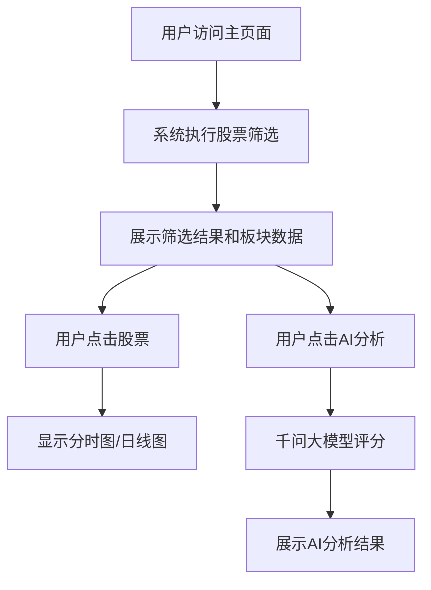

## 1. 产品概述
股票打板分析Web应用，基于Python脚本的股票筛选策略，提供实时股票数据展示、板块分析、AI智能评分等功能。帮助投资者快速识别潜力股票，优化投资决策。

面向个人投资者和量化交易者，提供直观、高效的股票分析工具，结合AI大模型分析提升选股准确性。

## 2. 核心功能

### 2.1 用户角色
| 角色 | 注册方式 | 核心权限 |
|------|----------|----------|
| 普通用户 | 邮箱注册/游客访问 | 查看股票筛选结果、板块数据、AI评分 |
| 高级用户 | 邀请码升级 | 自定义筛选参数、保存关注股票、导出数据 |

### 2.2 功能模块
股票打板分析应用包含以下核心页面：
1. **主分析页面**：股票筛选结果展示、板块涨幅监控、空头股票标识
2. **图表详情页面**：分时图/日线图展示、技术指标分析
3. **AI分析页面**：千问大模型智能评分、买入建议分析

### 2.3 页面详情
| 页面名称 | 模块名称 | 功能描述 |
|----------|----------|----------|
| 主分析页面 | 股票筛选结果 | 展示符合打板条件的股票列表，包含股票代码、名称、当前价格、涨跌幅、成交量、总市值等关键信息 |
| 主分析页面 | 板块监控面板 | 实时显示涨幅超过2%的概念板块，包含板块名称、涨幅、上涨家数、下跌家数、领涨股票 |
| 主分析页面 | 空头标识 | 自动标识价格低于MA20均线的股票，用红色标记显示，帮助识别弱势股票 |
| 主分析页面 | 实时数据刷新 | 每30秒自动刷新股票和板块数据，确保信息时效性 |
| 图表详情页面 | 分时图展示 | 点击股票后在右侧显示当日分时走势图，包含价格线、成交量柱、均线等指标 |
| 图表详情页面 | 日线图展示 | 提供日线K线图切换，显示历史价格走势、技术指标、支撑阻力位 |
| 图表详情页面 | 数据切换 | 支持分时图和日线图之间的快速切换，提供不同时间维度的分析视角 |
| AI分析页面 | 智能评分 | 调用千问大模型对筛选股票进行买入评分，分数范围1-10分 |
| AI分析页面 | 分析理由 | 显示AI分析的具体理由，包括技术面、基本面、市场情绪等多维度分析 |
| AI分析页面 | 排序筛选 | 按AI评分高低排序，优先展示高评分股票，支持评分范围筛选 |

## 3. 核心流程

### 用户操作流程
1. 用户访问主分析页面，系统自动执行股票筛选逻辑
2. 页面加载完成后展示筛选结果，包含股票列表和板块监控
3. 用户点击任意股票，右侧显示该股票的详细图表
4. 用户可切换查看分时图或日线图进行分析
5. 点击"AI分析"按钮，系统调用千问大模型对当前股票池进行评分
6. 根据AI评分结果，用户可以优先关注高评分股票

## 4. 用户界面设计

### 4.1 设计风格
- **主色调**：深蓝色(#1e3a8a)配金色(#f59e0b)，体现金融专业感
- **按钮样式**：圆角矩形设计，主要操作用实心按钮，次要操作用边框按钮
- **字体选择**：中文使用思源黑体，英文使用Inter，字号12-16px
- **布局风格**：左侧数据列表+右侧详情面板的经典金融应用布局
- **图标风格**：使用简洁的线性图标，涨跌用红绿色箭头表示

### 4.2 页面设计概述
| 页面名称 | 模块名称 | UI元素 |
|----------|----------|--------|
| 主分析页面 | 股票筛选结果 | 表格形式展示，表头固定，支持排序和筛选。涨跌幅用红绿色显示，涨停股票用金色背景高亮 |
| 主分析页面 | 板块监控面板 | 卡片式布局，每个板块用独立卡片显示，包含板块名称、涨幅百分比、涨跌家数统计 |
| 主分析页面 | 空头标识 | 空头股票在股票列表中用红色边框标识，股票代码前显示📉图标 |
| 图表详情页面 | 分时图展示 | 使用TradingView风格的图表，深色背景，绿色涨红色跌，包含价格线和成交量副图 |
| 图表详情页面 | 日线图展示 | K线图显示，包含5日、10日、20日均线，支持技术指标叠加 |
| AI分析页面 | 智能评分 | 评分用星级显示，9-10分用金色五星，7-8分用银色四星，5-6分用铜色三星 |

### 4.3 响应式设计
- **桌面优先**：主要针对1920x1080分辨率优化，支持多窗口并排显示
- **移动端适配**：支持平板和手机访问，采用响应式表格和可滑动面板
- **触控优化**：按钮和交互元素尺寸适配触控操作，图表支持手势缩放

### 4.4 数据可视化指导
- **图表类型**：分时图使用面积图，日线图使用K线图
- **颜色规范**：涨幅用绿色(#10b981)，跌幅用红色(#ef4444)，平盘用灰色(#6b7280)
- **动画效果**：数据更新时显示淡入淡出效果，图表切换使用平滑过渡
- **交互反馈**：鼠标悬停显示详细数据，点击股票时有视觉反馈效果