# BitPro 产品说明书（高清图文穿插版）

生成时间：2026-05-09 14:57:44 Asia/Shanghai
截图来源：`http://47.79.36.92:8888`
截图规格：2560x1440 视口，DPR=2，PNG 原图保存；本轮已等待页面业务数据加载完成后重采，主截图分辨率 5120×2880。

> **2026-08-24 对齐说明**：本说明书初版覆盖当时的一级页面。此后产品新增了复盘中心、盯盘、链上研究、因子库、套利中心和自主研究（ARC）六个工作台，已在「页面单元 62–67」补齐文字说明（对应生产截图待按复采规则采集）；全局导航与 AI 预测区章节已同步校准到当前行为。页面级权威设计文档见 `docs/pages/`。

> 适用范围：本文档说明 BitPro 生产页面的功能用法、策略执行链路和操作边界。默认语义为策略研究、回测和 paper/simulation；实盘相关功能必须经过显式账户绑定、预检和人工确认。本文不是投资建议，也不是实盘操作建议。

## 截图索引

| 编号 | 页面 | 路由 | 文件 | 分辨率 | 说明 |
| --- | --- | --- | --- | --- | --- |
| 图01 | 首页行情总览 | `/` | `screenshots/01-home-overview.png` | 5120×2880 | 首页行情表、左侧导航和 OKX 实时行情入口。 |
| 图02 | 行情 K 线与订单簿 | `/market` | `screenshots/02-market-kline-orderbook.png` | 5120×2880 | BTC/USDT K 线、AI 预测和订单簿。 |
| 图03 | 行情周期切换区 | `/market` | `screenshots/03-market-timeframes.png` | 5120×2880 | 1m/5m/15m/1h/4h/1d 周期入口和 AI 预测说明。 |
| 图04 | 策略中心列表 | `/strategy` | `screenshots/04-strategy-center.png` | 5120×2880 | 策略筛选、运行状态、资产类型和策略卡片。 |
| 图05 | 策略详情页 | `/strategy` | `screenshots/05-strategy-detail.png` | 5120×2880 | 策略核心选股与交易逻辑详情。 |
| 图06 | 新建策略弹窗 | `/strategy` | `screenshots/06-strategy-create-modal.png` | 5120×2880 | 策略名称、描述、交易所、交易对和参数 JSON 输入。 |
| 图07 | 回测控制台 | `/backtest` | `screenshots/07-backtest-console.png` | 5120×2880 | 回测历史、筛选、排序和结果入口。 |
| 图08 | 回测创建向导 | `/backtest` | `screenshots/08-backtest-create-wizard.png` | 5120×2880 | 创建回测实例的策略选择与配置向导。 |
| 图09 | 回测历史详情 | `/backtest` | `screenshots/09-backtest-history-detail.png` | 5120×2880 | 历史回测详情中的绩效、曲线和成交记录。 |
| 图10 | 模拟实例控制台 | `/live` | `screenshots/10-live-console.png` | 5120×2880 | 多策略模拟实例列表、资产类型筛选和收益排序。 |
| 图11 | 模拟创建向导 | `/live` | `screenshots/11-live-create-wizard.png` | 5120×2880 | 创建模拟实例的策略选择、运行参数与预检入口。 |
| 图12 | 模拟实例详情顶部 | `/live?strategyId=54` | `screenshots/12-live-instance-detail-top.png` | 5120×2880 | 数据加载完成后的运行中模拟实例，包含账户 KPI、核心逻辑、持仓和成交入口。 |
| 图13 | 模拟实例详情持仓成交 | `/live?strategyId=54` | `screenshots/13-live-instance-detail-lower.png` | 5120×2880 | 数据加载完成后的运行中模拟实例，展示非空持仓、成交明细、诊断日志和账户曲线。 |
| 图14 | 监控中心总览 | `/monitor` | `screenshots/14-monitor-overview.png` | 5120×2880 | 组合 KPI、收益推送、运行策略和告警配置。 |
| 图15 | 监控告警创建弹窗 | `/monitor` | `screenshots/15-monitor-alert-modal.png` | 5120×2880 | 策略收益回撤、爆仓距离、价格和资金费率告警配置。 |
| 图16 | 信号中心总览 | `/signals` | `screenshots/16-signals-overview.png` | 5120×2880 | 通道配置、策略选择、信号策略列表和策略信号。 |
| 图17 | 信号通道编辑 | `/signals` | `screenshots/17-signals-channel-edit.png` | 5120×2880 | OKX Signal Bot 通道编辑表单和敏感字段脱敏。 |
| 图18 | 信号 Payload 区域 | `/signals` | `screenshots/18-signals-signal-detail.png` | 5120×2880 | 策略信号状态、动作、过期时间和 Payload 说明。 |
| 图19 | 实盘工作台总览 | `/live-real` | `screenshots/19-live-real-overview.png` | 5120×2880 | 实盘账户摘要、策略选择、实盘策略列表和部署面板。 |
| 图20 | 实盘新增账户弹窗 | `/live-real` | `screenshots/20-live-real-add-account.png` | 5120×2880 | 新增 OKX 实盘账户表单，密钥字段只说明不暴露。 |
| 图21 | 实盘策略绑定区 | `/live-real` | `screenshots/21-live-real-strategy-binding.png` | 5120×2880 | 策略加入、账户绑定和实盘列表视角。 |
| 图22 | 数据管理中心 | `/data` | `screenshots/22-data-overview.png` | 5120×2880 | 数据总量、同步状态、同步任务和交易对周期覆盖。 |
| 图23 | 同步配置弹窗 | `/data` | `screenshots/23-data-sync-modal.png` | 5120×2880 | 增量/自定义/全量同步共用配置弹窗。 |
| 图24 | 增加交易对弹窗 | `/data` | `screenshots/24-data-add-symbol-modal.png` | 5120×2880 | 自定义 USDT 交易对添加入口。 |
| 图25 | AI 自主交易 | `/ai-lab?tab=autonomous` | `screenshots/25-ai-autonomous.png` | 5120×2880 | AI 自主交易模拟盘、硬性风控、实例操作台。 |
| 图26 | AI 自主交易编辑配置 | `/ai-lab?tab=autonomous` | `screenshots/26-ai-autonomous-config.png` | 5120×2880 | AI 模型、杠杆、仓位、等待时间和交易频率配置。 |
| 图27 | AI 新策略研发 | `/ai-lab?tab=research` | `screenshots/27-ai-research.png` | 5120×2880 | AI 策略猎手、研发市场、模型、提示词和绩效目标。 |
| 图28 | AI 现有策略优化 | `/ai-lab?tab=optimizer` | `screenshots/28-ai-optimizer.png` | 5120×2880 | 自动优化扫描、AI 诊断、回测验证和试运行流程。 |

## 页面单元目录

- 页面单元 01：产品定位、边界与阅读方式
- 页面单元 02：全局导航与页面地图
- 页面单元 03：安全角色、资金边界与默认模式
- 页面单元 04：首页：系统概览与行情入口
- 页面单元 05：行情页：交易对选择与实时行情
- 页面单元 06：K 线图：周期、指标与趋势判断
- 页面单元 07：AI 预测区：预测线、置信与误差理解
- 页面单元 08：订单簿：买卖深度、价差与流动性
- 页面单元 09：行情页到策略研发的连接方式
- 页面单元 10：数据管理中心：数据资产总览
- 页面单元 11：同步任务：增量、自定义与全量同步
- 页面单元 12：同步配置弹窗：日期、标的与周期选择
- 页面单元 13：增加交易对：自定义研究标的维护
- 页面单元 14：数据质量检查与回测前准备
- 页面单元 15：策略中心：列表、筛选与策略状态
- 页面单元 16：策略卡片：字段含义与快速操作
- 页面单元 17：策略详情：核心选股与交易逻辑
- 页面单元 18：新建策略弹窗：配置项与 JSON 参数
- 页面单元 19：策略命名与资产类型规范
- 页面单元 20：策略如何执行：BaseStrategy 生命周期
- 页面单元 21：策略执行图：从行情到成交记录
- 页面单元 22：PaperBroker：现货模拟账户
- 页面单元 23：ContractPaperBroker：合约模拟账户
- 页面单元 24：策略风险控制：仓位、止损、止盈与冷却
- 页面单元 25：回测控制台：历史验证入口
- 页面单元 26：回测创建向导：策略、日期和确认
- 页面单元 27：回测成本模型：maker、taker 与滑点
- 页面单元 28：回测详情：KPI、曲线与基准
- 页面单元 29：回测成交明细：历史成交价与开仓未平
- 页面单元 30：回测失败处理：缺数据与真实 K 线原则
- 页面单元 31：模拟控制台：Paper 实例管理
- 页面单元 32：模拟创建向导：运行参数与飞行检查
- 页面单元 33：模拟实例详情：顶部 KPI 与核心逻辑
- 页面单元 34：持仓与成交：从 Paper 状态审计执行
- 页面单元 35：诊断日志：策略事件与故障定位
- 页面单元 36：监控中心：组合 KPI 与运行面板
- 页面单元 37：运行策略卡片：收益、仓位与跳转
- 页面单元 38：收益卡片推送：Feishu/通知配置
- 页面单元 39：告警创建：场景模板与阈值
- 页面单元 40：信号中心：通道、策略与信号列表
- 页面单元 41：OKX Signal Bot 通道配置
- 页面单元 42：信号策略列表：启用、确认与路由
- 页面单元 43：Payload 预览：OKX 自定义 JSON 审计
- 页面单元 44：人工确认、重试与取消
- 页面单元 45：实盘工作台：显式确认的 Live 边界
- 页面单元 46：实盘账户管理：新增与掩码展示
- 页面单元 47：实盘策略绑定：从 Paper 策略到候选列表
- 页面单元 48：实盘预检：权限、配置和风险检查
- 页面单元 49：实盘部署面板：试运行克隆、持仓与订单
- 页面单元 50：实盘审计与脱敏要求
- 页面单元 51：AI策略助手总览：三个主工作流
- 页面单元 52：AI自主交易：Paper-only 合约研究
- 页面单元 53：AI自主交易配置：模型与硬风控
- 页面单元 54：AI 新策略研发：从假设到候选策略
- 页面单元 55：AI 研发任务状态：迭代、评分与保存
- 页面单元 56：现有策略优化：Paper 策略的改良闭环
- 页面单元 57：AI 模型、API Key 与无 mock 原则
- 页面单元 58：端到端操作剧本：从想法到监控
- 页面单元 59：日常巡检清单
- 页面单元 60：故障排查路径：页面、API、数据、策略
- 页面单元 61：文档维护与截图复采规则
- 页面单元 62：复盘中心：运行策略的小时级复盘
- 页面单元 63：盯盘：账户持仓标的行情跟踪
- 页面单元 64：链上研究：DeFiLlama 链上看板
- 页面单元 65：因子库：FactorLab 因子目录与 ML 验证
- 页面单元 66：套利中心：跨所机会与净优势计算
- 页面单元 67：自主研究：ARC 控制台

## 页面单元 01：产品定位、边界与阅读方式

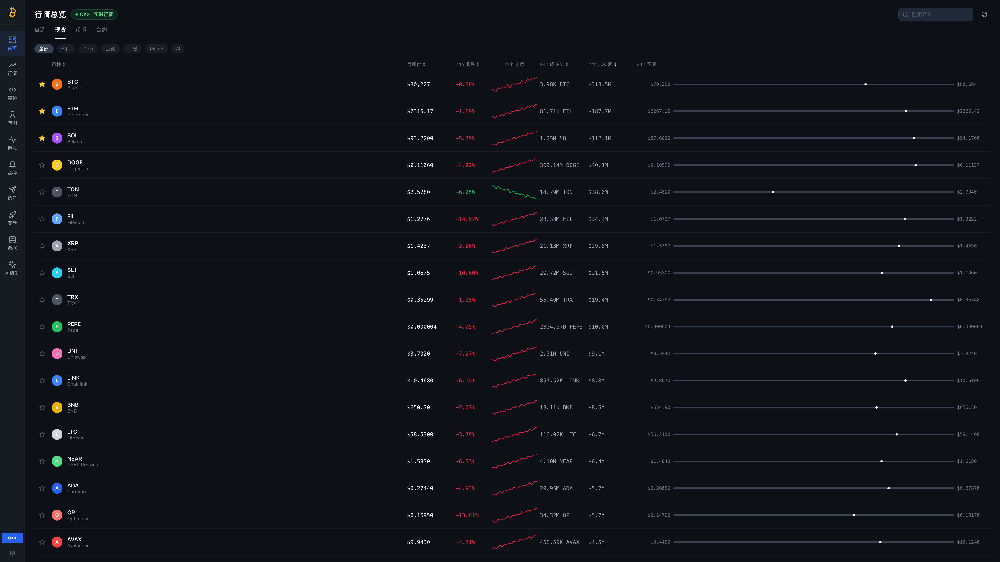

*图01 - 首页行情总览。来源：生产路由 `/`，5120×2880 PNG。*
BitPro 是面向量化策略研究、回测、模拟盘运行、信号审计、监控告警和 AI 辅助研发的一体化工作台。普通使用流程不是“先下单”，而是先看行情和数据质量，选择或研发策略，再回测，随后以 paper/simulation 模式运行，最后根据监控、诊断日志和人工审核结果决定是否输出信号或进入明确确认的实盘试运行流程。

本文档按 61 个页面单元组织，每个单元都说明页面入口、主要模块、操作步骤和执行机制。截图来自生产地址普通浏览器导航，不使用 mock、不注入演示数据；涉及 Webhook、token、API Key、账户标识和实盘余额的区域已做轻度脱敏。

## 页面单元 02：全局导航与页面地图

*图01 - 首页行情总览。来源：生产路由 `/`，5120×2880 PNG。*
左侧导航是产品的主工作流骨架：`首页` 用于快速看行情与系统状态，`行情` 进入 K 线和订单簿，`数据` 管理 K 线缓存和同步任务，`策略` 管理策略定义，`回测` 做历史验证，`模拟盘` 启动 paper 实例，`监控` 汇总运行策略和告警，`复盘中心` 提供运行中策略的小时级复盘评分，`盯盘` 跟踪账户持仓标的行情，`链上研究` 提供 DeFiLlama 链上看板，`信号` 管理 OKX Signal Bot 通道，`实盘` 是显式确认后的 OKX Trade API 订阅执行工作台，`AI研发` 承接自主交易、策略研发和策略优化。侧边栏之外还有直达路由 `套利中心`（`/arbitrage`）、`因子库`（`/factorlab`）和 `自主研究`（`/arc`），以及全站登录门禁与设置中心。

建议按“数据 -> 策略 -> 回测 -> 模拟 -> 监控/复盘 -> 信号 -> 实盘预检”的顺序使用。直接跳到后置页面虽然可行，但缺少数据覆盖、策略逻辑、风控参数和模拟结果的上下文，容易误判页面指标。

## 页面单元 03：安全角色、资金边界与默认模式

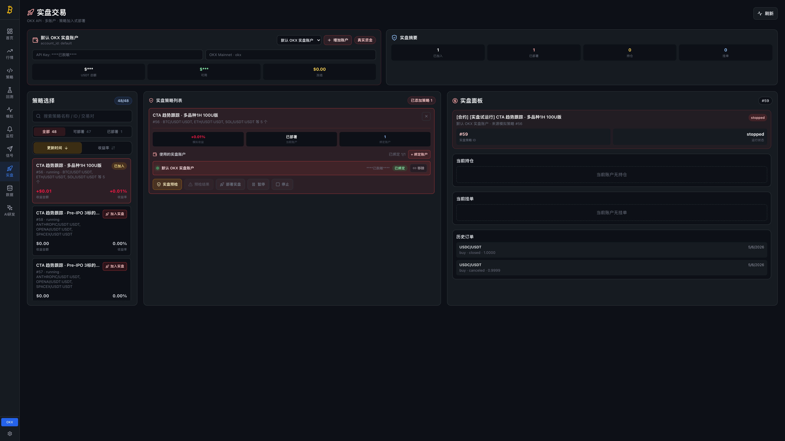

*图19 - 实盘工作台总览。来源：生产路由 `/live-real`，5120×2880 PNG。*
BitPro 的默认策略运行语义是 paper/simulation。模拟盘可以使用真实市场数据、真实交易所元数据和真实模型预测，但账户余额、持仓、成交、盈亏、风控状态都来自 paper broker，不应从真实交易所账户派生。

涉及真实 OKX 私钥、账户余额、挂单和实盘订单的页面需要明确进入 `实盘` 工作台，并经过账户绑定、预检、部署确认等步骤。说明书中的实盘章节只解释页面用法和安全边界，不代表建议开启真实资金交易。所有 API Key、Webhook 和 token 都应只在受控环境保存，截图和文档不得暴露明文。

## 页面单元 04：首页：系统概览与行情入口

*图01 - 首页行情总览。来源：生产路由 `/`，5120×2880 PNG。*
首页用于让操作者快速判断系统是否具备研究条件。页面顶部展示行情概览和关键资产价格，中间区域聚合常用入口，左侧仍保留完整导航。若只是确认当前行情、进入某个功能页，首页是最短路径；若需要做策略评估，应继续进入行情、数据或回测页面查看更细粒度信息。

使用时先确认行情价格是否刷新，再看页面是否出现网络错误或服务不可用提示。生产截图中的行情表来自 OKX 公共市场数据，适合作为“页面连通性”和“市场基准”的第一层检查，但不能替代回测数据覆盖检查。

## 页面单元 05：行情页：交易对选择与实时行情

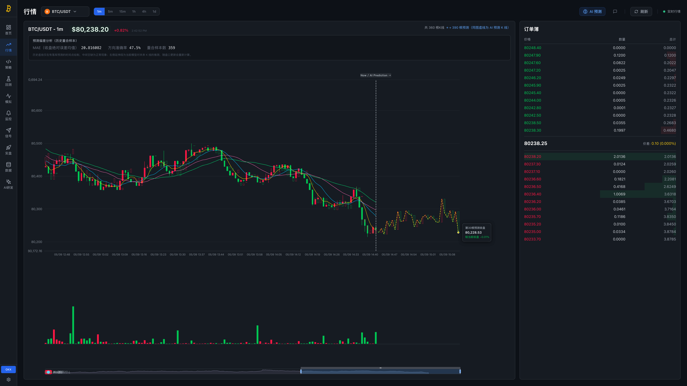

*图02 - 行情 K 线与订单簿。来源：生产路由 `/market`，5120×2880 PNG。*
行情页以交易对为中心组织数据。操作者可以切换 BTC/USDT 等交易对，查看最新价格、涨跌幅、成交量、K 线和盘口。页面适合用于确认策略标的的近期波动、趋势状态和流动性基础。

策略研发时，不要只看单个瞬间价格。应结合周期切换、AI 预测、订单簿和后续回测结果判断信号是否稳定。若页面没有最新 K 线或盘口为空，需要先检查数据管理同步和后端 market API。

## 页面单元 06：K 线图：周期、指标与趋势判断

*图02 - 行情 K 线与订单簿。来源：生产路由 `/market`，5120×2880 PNG。*

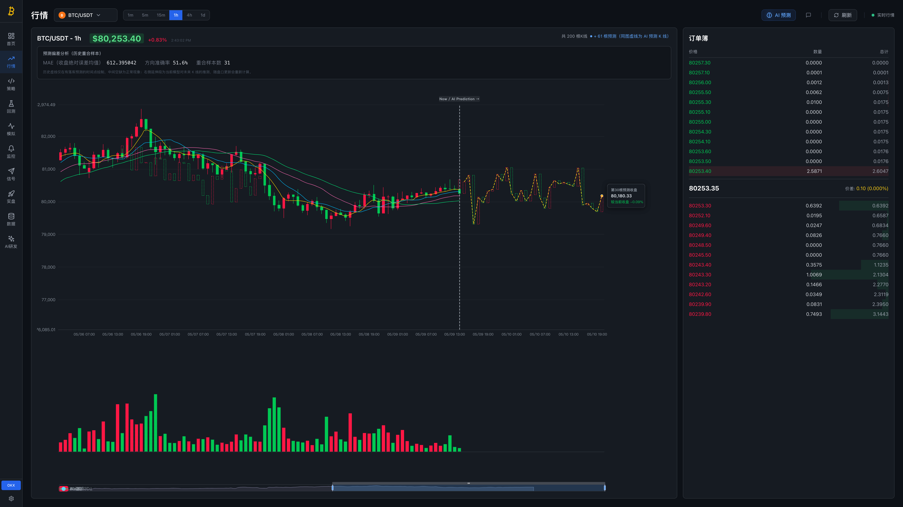

*图03 - 行情周期切换区。来源：生产路由 `/market`，5120×2880 PNG。*
K 线区展示不同时间尺度的价格序列。短周期（如 1m、5m）适合观察微观波动和执行噪声，长周期（如 1h、4h、1d）更适合看趋势和策略级别方向。页面中的周期按钮只是观察维度，不会自动改变已有策略实例的运行周期。

使用时应先选定研究目的：做高频观察看短周期，做趋势策略验证看中长周期。若策略配置里有固定 timeframe，以策略配置为准；行情页切换周期主要用于人工检查，不直接改写策略。

## 页面单元 07：AI 预测区：预测线、置信与误差理解

*图02 - 行情 K 线与订单簿。来源：生产路由 `/market`，5120×2880 PNG。*

*图03 - 行情周期切换区。来源：生产路由 `/market`，5120×2880 PNG。*
行情页的 AI 预测区当前处于 fail-closed 关闭状态：生产后端 `KAIROS_INFERENCE_ENABLED=false`、`SUPERPNL_INFERENCE_ENABLED=false` 时，预测模型不加载、不下载数据，`/market` 页面也不渲染 AI 预测开关或调用预测客户端。这是刻意的边界：历史 Kairos/SuperPnL 研究代码保留作回溯资料，但恢复生产推理必须经过代码评审和资源验证，且任何情况下都不得使用 mock、随机游走或模板动量数据替代真实模型输出。

若未来预测能力重新启用，看预测时重点比较三件事：第一，预测方向是否与近期趋势一致；第二，预测幅度是否超过手续费和滑点成本；第三，历史误差是否较大。若模型输出与订单簿、成交量或更长周期趋势矛盾，应降低信号权重，转入回测或模拟盘验证。

## 页面单元 08：订单簿：买卖深度、价差与流动性

*图02 - 行情 K 线与订单簿。来源：生产路由 `/market`，5120×2880 PNG。*
订单簿展示买盘、卖盘、盘口价差和局部深度。它用于判断当前价格是否容易成交，以及策略下单可能遇到的滑点。价差越宽、深度越薄，市价执行成本越高；对合约策略，低流动性还会放大强平和止损失效风险。

在策略执行层，paper broker 用 K 线或标记价格模拟成交，不等于真实盘口可成交价格。因此从订单簿看到明显流动性不足时，应在回测成本参数和模拟风险限额中提高 slippage 或降低仓位。

## 页面单元 09：行情页到策略研发的连接方式

*图02 - 行情 K 线与订单簿。来源：生产路由 `/market`，5120×2880 PNG。*
行情页通常用于发现研究假设：例如趋势延续、均值回归、资金费率异常、订单簿失衡或 AI 预测路径偏斜。真正落到策略时，需要把这些观察转换成可执行规则，例如入场条件、过滤条件、仓位上限、退出条件和冷却时间。

推荐记录“看到什么、为什么可能有效、需要什么数据验证”。随后在策略中心选择相近内置策略或进入 AI 新策略研发，把观察拆成可回测的因子和交易逻辑。

## 页面单元 10：数据管理中心：数据资产总览

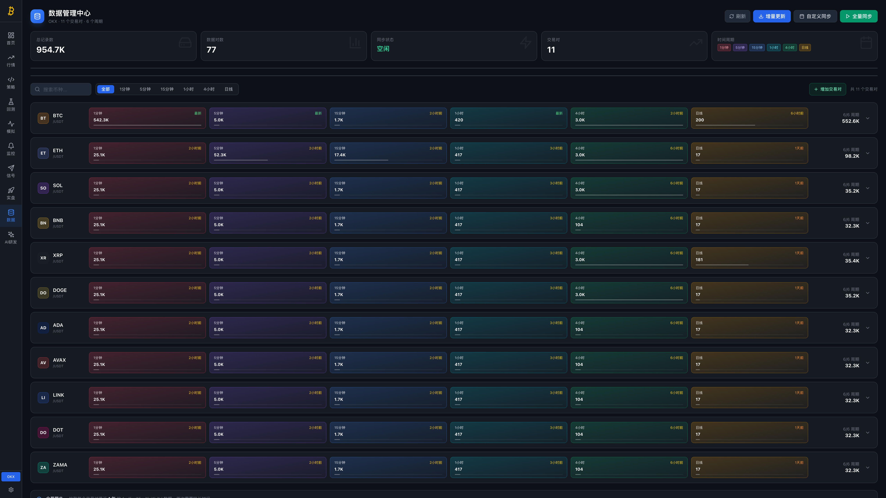

*图22 - 数据管理中心。来源：生产路由 `/data`，5120×2880 PNG。*
数据管理中心展示本地 K 线缓存、同步任务状态、交易对覆盖和周期覆盖。它是回测可靠性的前置条件：如果某个策略需要多标的、多周期或较长历史窗口，必须先确认对应数据已经存在并覆盖回测日期范围。

页面中的交易对卡片和统计信息来自后端文件 K 线存储与同步元数据。旧 SQLite K 线表只作为兼容兜底，不能被当作主要数据源。若回测报缺数据，应优先回到这里补齐。

## 页面单元 11：同步任务：增量、自定义与全量同步

*图22 - 数据管理中心。来源：生产路由 `/data`，5120×2880 PNG。*

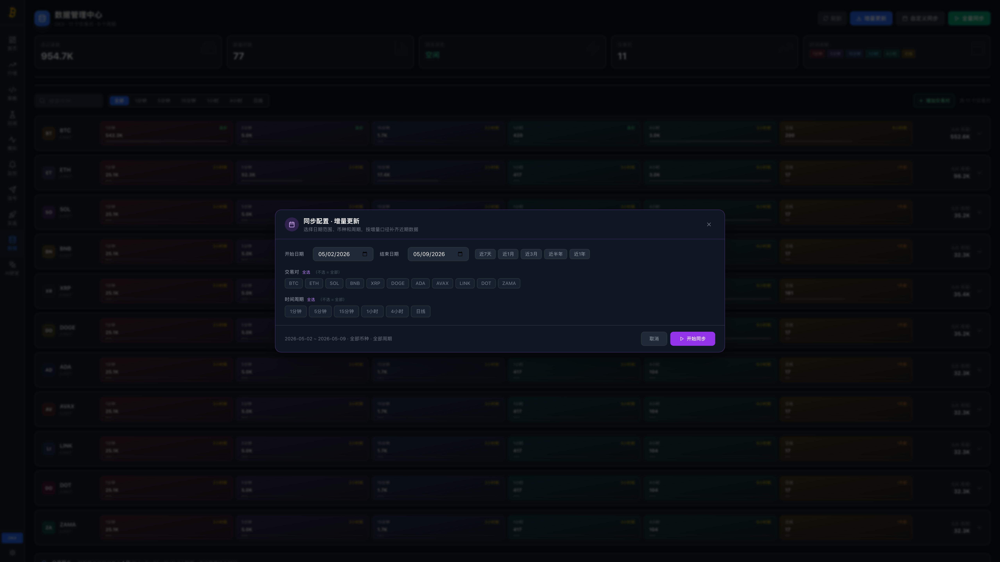

*图23 - 同步配置弹窗。来源：生产路由 `/data`，5120×2880 PNG。*
顶部同步入口分为增量更新、自定义同步和全量同步。现在这些入口都会先打开同步配置弹窗，操作者需要确认日期范围、交易对范围和周期范围后再提交。增量同步适合日常补齐最新数据，自定义同步适合修补特定区间，全量同步适合初始化或大规模重建。

提交后页面会显示当前任务和任务明细。每个交易对/周期会记录状态、拉取数量、新增数量、checkpoint 和耗时；后端重启或浏览器断开后，任务可以通过持久化 job/item 继续恢复。

## 页面单元 12：同步配置弹窗：日期、标的与周期选择

*图23 - 同步配置弹窗。来源：生产路由 `/data`，5120×2880 PNG。*
同步配置弹窗是避免误触大规模任务的保护层。开始日期和结束日期决定历史窗口，交易对决定标的范围，周期决定 K 线粒度。大范围全量同步可能较慢，建议先用自定义范围验证任务链路，再扩大范围。

配置时要让回测需求倒推同步范围：例如 4H 趋势策略通常需要较长历史窗口，1m 网格或马丁策略需要高频粒度；多标的策略必须同步完整标的池，否则回测应失败并提示缺失标的，而不是自动缩小宇宙。

## 页面单元 13：增加交易对：自定义研究标的维护

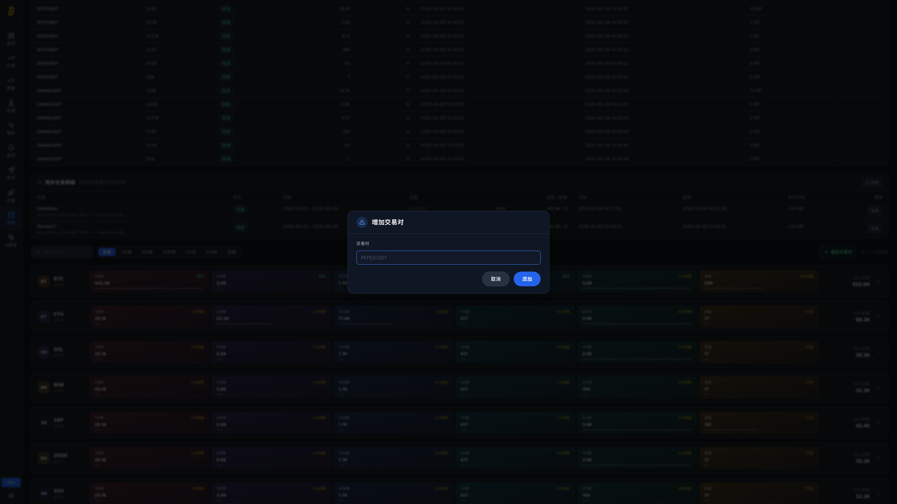

*图24 - 增加交易对弹窗。来源：生产路由 `/data`，5120×2880 PNG。*
增加交易对用于把新的 USDT 现货交易对加入数据管理范围。输入可以是基础币代码或标准交易对，后端会规范化为 `BASE/USDT` 形式并写入应用设置。保存后，新增交易对会出现在筛选和同步配置中。

该操作只维护研究数据范围，不会自动创建策略，也不会自动下单。新增标的后应立即同步所需周期，并在行情页确认 K 线可读，再进入回测或策略研发。

## 页面单元 14：数据质量检查与回测前准备

*图22 - 数据管理中心。来源：生产路由 `/data`，5120×2880 PNG。*
回测前至少检查四类数据质量：标的是否完整、周期是否完整、日期覆盖是否足够、最新同步时间是否符合研究目的。对于需要完整同一时间戳多标的批次的策略，任何一个标的缺失都可能让信号不成立。

若页面显示同步失败，应展开任务明细查看是网络、交易对、周期还是存储错误。不要用缺失数据跑回测后解读指标；BitPro 的设计原则是缺数据时显式失败或提示，而不是用合成数据替代。

## 页面单元 15：策略中心：列表、筛选与策略状态

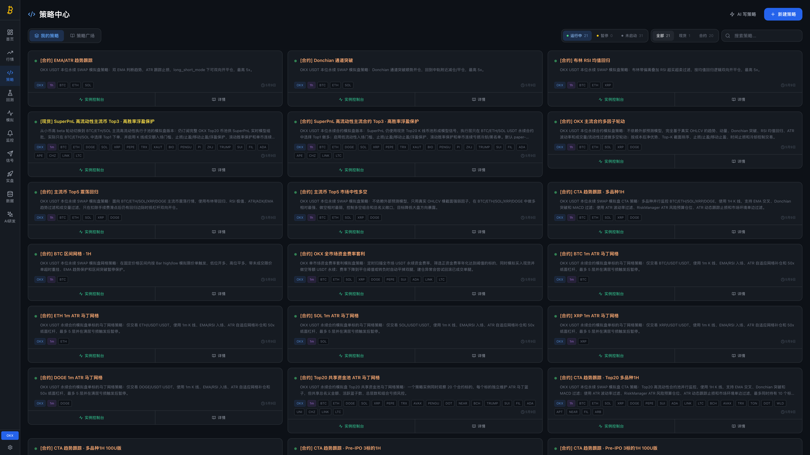

*图04 - 策略中心列表。来源：生产路由 `/strategy`，5120×2880 PNG。*
策略中心是策略定义的目录。卡片会展示策略名称、资产类型、状态、交易对、描述和操作入口。策略名称中的 `[现货]`、`[合约]` 前缀是规范的一部分，用于区分执行接口、资产类型和 UI 颜色。

筛选时可按全部、现货、合约和状态查看。策略中心展示的是“策略定义和状态摘要”，不是完整运行详情；需要查看模拟账户、成交、持仓和日志时，应进入模拟实例详情或监控中心。

## 页面单元 16：策略卡片：字段含义与快速操作

*图04 - 策略中心列表。来源：生产路由 `/strategy`，5120×2880 PNG。*
策略卡片上的交易对代表策略关注或执行的市场范围；状态代表当前是否运行、停止或异常；收益、交易数等信息来自运行状态或持久化统计。对于内置策略，卡片通常还关联 seed 配置、策略 key 和默认参数。

快速操作包括查看详情、编辑或进入模拟启动流程。对正在运行的策略，操作前应先确认它属于模拟还是实盘试运行，避免把策略定义、paper 实例和 live clone 混为一谈。

## 页面单元 17：策略详情：核心选股与交易逻辑

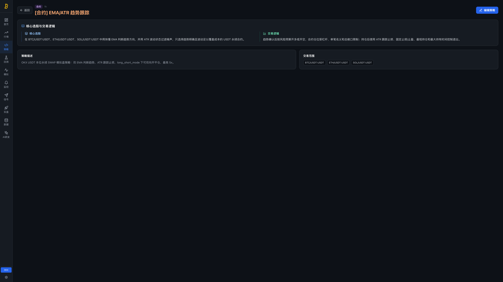

*图05 - 策略详情页。来源：生产路由 `/strategy`，5120×2880 PNG。*
策略详情页展示策略说明、核心选股逻辑和交易逻辑。核心选股说明“为什么关注这些标的”，交易逻辑说明“何时开仓、加仓、减仓、退出”。这些字段来自策略配置中的 explainability metadata，用于人工审计，不直接改变执行结果。

阅读策略详情时，应把逻辑拆成四层：数据输入、信号生成、仓位 sizing、风险退出。只有这四层都清楚，后续回测指标和模拟日志才有可解释性。

## 页面单元 18：新建策略弹窗：配置项与 JSON 参数

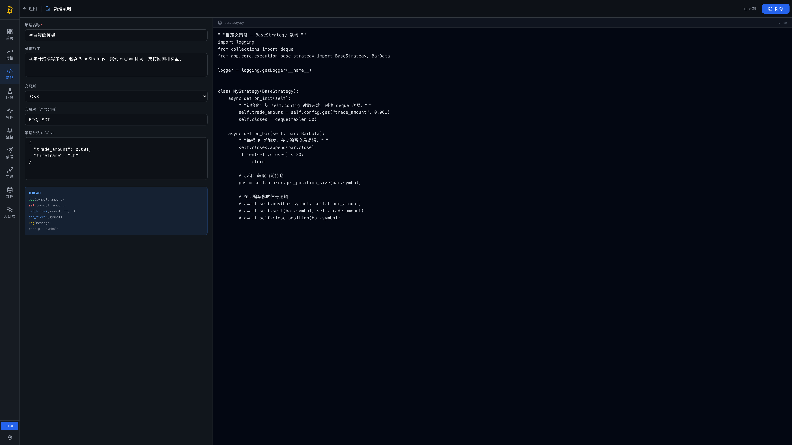

*图06 - 新建策略弹窗。来源：生产路由 `/strategy`，5120×2880 PNG。*
新建策略弹窗用于创建策略定义。常见字段包括名称、描述、交易所、交易对、策略类型和参数 JSON。名称必须遵守资产前缀规范：现货策略使用 `[现货]`，合约或永续策略使用 `[合约]`。

参数 JSON 应包含策略运行所需的阈值、窗口、仓位上限、止损止盈、杠杆、冷却时间等。创建策略不等于启动策略；策略创建后还需要回测或模拟启动。若是 AI 生成策略，必须先经过代码安全校验、回测和人工接受。

## 页面单元 19：策略命名与资产类型规范

*图04 - 策略中心列表。来源：生产路由 `/strategy`，5120×2880 PNG。*
BitPro 约定所有 seed、生产策略行、UI 文案和新生成策略元数据都应保留资产前缀。`[现货]` 表示通过 spot buy/sell 做多或卖出，`[合约]` 表示使用 USDT 永续/衍生品接口，可以开多、开空、使用杠杆和合约保证金模型。

该前缀不只是展示样式。它会影响使用者对风险、回测成本、模拟 broker 和实盘预检的判断。策略复制、优化、保存 AI 候选或写入生产 SQLite 时都应保留前缀。

## 页面单元 20：策略如何执行：BaseStrategy 生命周期

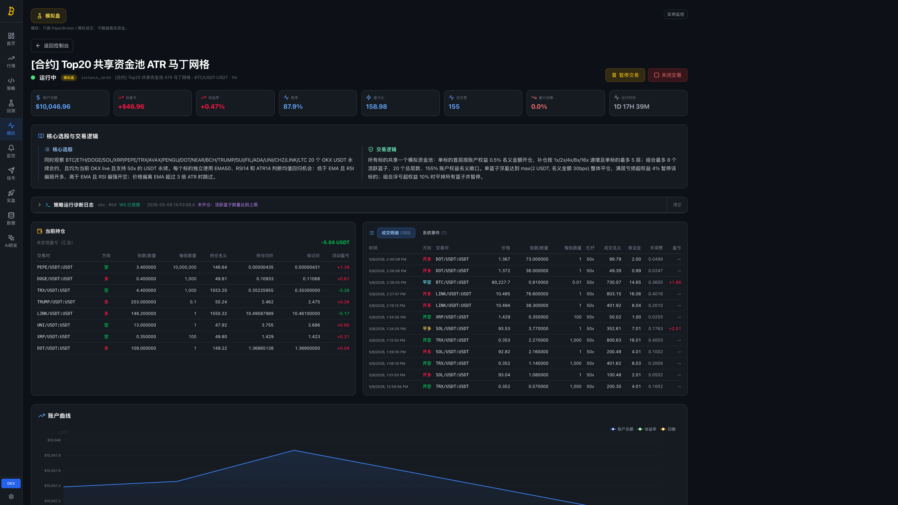

*图12 - 模拟实例详情顶部。来源：生产路由 `/live`，5120×2880 PNG。*
BitPro 的可运行策略通常继承统一的 `BaseStrategy`。初始化阶段读取 `self.config` 并准备窗口、状态和参数；启动后策略引擎按交易对和周期喂入确认后的 K 线 `BarData`；策略在 `on_bar` 中计算信号，决定是否调用现货 `buy/sell` 或合约 `open_contract/close_contract`。

执行链路可以概括为：策略定义 -> 策略引擎加载 -> 数据预热 -> 每根 K 线触发策略逻辑 -> broker 撮合 -> 成交/持仓/事件持久化 -> UI 轮询展示。策略代码不应在单根 K 线里回看未来数据，也不应混用现货和合约接口。

## 页面单元 21：策略执行图：从行情到成交记录

*图12 - 模拟实例详情顶部。来源：生产路由 `/live`，5120×2880 PNG。*
以下流程帮助理解页面上的收益、持仓、成交和日志从哪里来。市场数据进入策略引擎后，策略只产生动作意图；真正的余额、成交、持仓和 PnL 由 broker 层计算并持久化。监控、模拟详情和信号中心再读取这些状态。

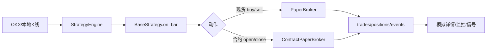
```mermaid
flowchart LR
  A[OKX/本地K线] --> B[StrategyEngine]
  B --> C[BaseStrategy.on_bar]
  C --> D{动作}
  D -->|现货 buy/sell| E[PaperBroker]
  D -->|合约 open/close| F[ContractPaperBroker]
  E --> G[trades/positions/events]
  F --> G
  G --> H[模拟详情/监控/信号]
```

如果某个页面指标异常，应沿这条链路定位：先看数据是否更新，再看策略日志，再看 broker 账户状态，最后看 UI 展示是否与 API 一致。

## 页面单元 22：PaperBroker：现货模拟账户

*图12 - 模拟实例详情顶部。来源：生产路由 `/live`，5120×2880 PNG。*

*图13 - 模拟实例详情持仓成交。来源：生产路由 `/live`，5120×2880 PNG。*
现货模拟使用 PaperBroker。它维护模拟现金、现货持仓、成交记录、手续费、已实现和未实现盈亏。策略调用 `buy(symbol, amount)` 时，amount 是币数量，不是 USDT 金额；调用 `sell` 时会检查持仓并计算卖出盈亏。

PaperBroker 的账户状态应完全来自模拟记录，不读取真实交易所私有账户。页面上的账户总额、可用余额、浮动盈亏、持仓市值和交易记录都应能从模拟 broker 状态解释。

## 页面单元 23：ContractPaperBroker：合约模拟账户

*图12 - 模拟实例详情顶部。来源：生产路由 `/live`，5120×2880 PNG。*

*图13 - 模拟实例详情持仓成交。来源：生产路由 `/live`，5120×2880 PNG。*
合约模拟使用 ContractPaperBroker，支持 USDT 永续的多空方向、杠杆、名义本金、保证金、资金费率和强平价格模型。策略调用 `open_contract(symbol, "long"|"short", notional_usdt, leverage=...)` 开仓，调用 `close_contract` 按比例或张数平仓。

合约策略的仓位单位和现货不同：入参通常是 USDT 名义本金，页面要关注保证金占用、杠杆、强平距离和多空比。合约策略严禁调用不存在的 open_long/open_short 简写，也不应用现货 buy/sell 代替合约开平仓。

## 页面单元 24：策略风险控制：仓位、止损、止盈与冷却

*图12 - 模拟实例详情顶部。来源：生产路由 `/live`，5120×2880 PNG。*
策略风控应在策略逻辑和 broker 约束两层同时存在。策略层定义最大单仓、总暴露、止损、止盈、跟踪止损、最大持仓时间、冷却期和质量门槛；broker 层负责余额、保证金、可用持仓、费用和成交记录的硬约束。

查看策略时，不只看收益率，还要看它如何处理亏损、连续错误、数据缺失和模型不可用。一个健康策略应在日志中说明跳过交易的原因，而不是沉默失败。

## 页面单元 25：回测控制台：历史验证入口

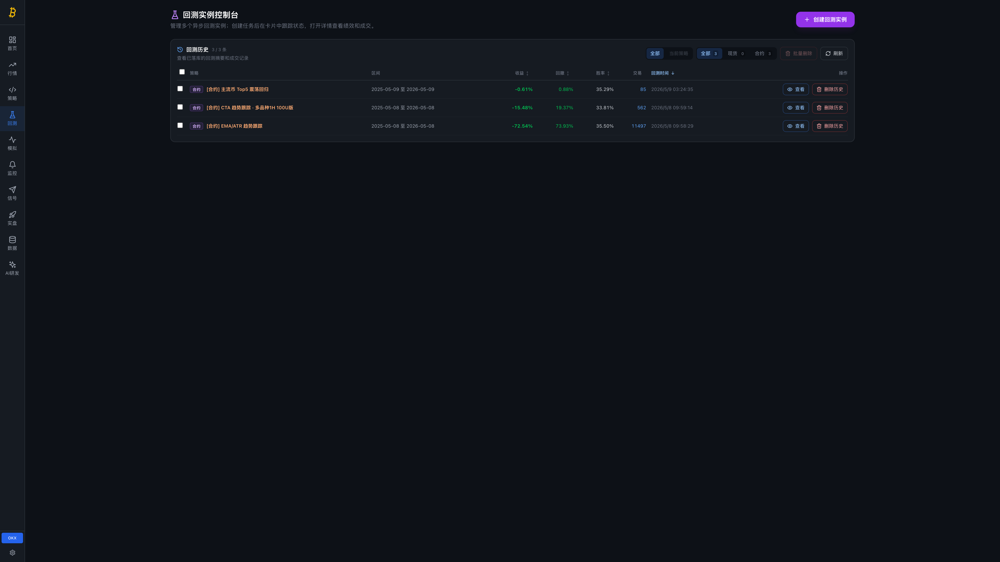

*图07 - 回测控制台。来源：生产路由 `/backtest`，5120×2880 PNG。*
回测控制台展示本地回测实例和持久化历史结果。它用于验证策略在历史真实 K 线上的表现，包括收益率、回撤、胜率、盈亏比、基准收益和成交明细。

首次进入时可能只看到历史列表或空状态；点击创建回测后进入向导。回测支持多个异步 job 并行运行，正在运行的实例可以停止，已持久化历史可以单独删除。不要把一次高收益回测当作上线依据，应结合不同区间、成本参数和模拟盘表现判断。

## 页面单元 26：回测创建向导：策略、日期和确认

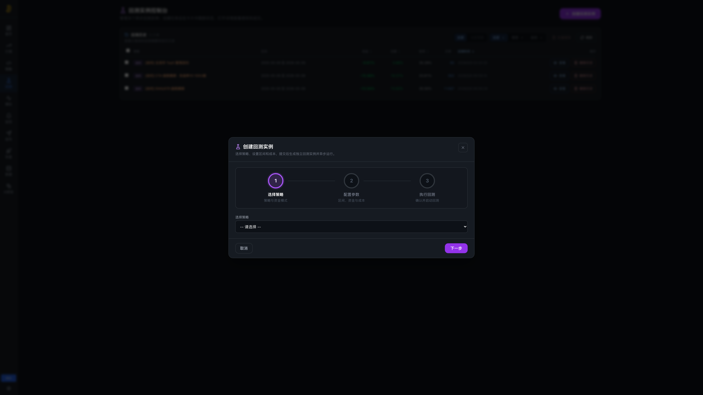

*图08 - 回测创建向导。来源：生产路由 `/backtest`，5120×2880 PNG。*
回测创建向导通常分为策略选择、日期/成本配置和最终确认。策略选择应使用可回测的 research/paper 策略，显式 live 或非 paper 行会从下拉中隐藏。日期范围默认结束在操作者当前日期，前端和后端都会阻止未来日期。

提交前确认三项：策略标的和周期是否与研究目标一致，数据管理中是否覆盖该区间，成本参数是否符合资产类型。提交后 job 后台运行，进度和结果回到控制台或详情页查看。

## 页面单元 27：回测成本模型：maker、taker 与滑点

*图08 - 回测创建向导。来源：生产路由 `/backtest`，5120×2880 PNG。*
回测成本使用 bps 字段表达，而不是一个模糊费率。现货默认更高的 maker/taker 成本，USDT 永续默认更低的合约费率；滑点单独配置。当前市场成交通常按 taker 费率加滑点模拟，maker 字段保留给未来 limit/orderbook 型回测。

调参时要避免只看无成本收益。高频策略、网格策略和多标的轮动策略对成本更敏感，slippage 过低会夸大收益。若订单簿显示流动性较薄，应主动提高滑点或减少仓位。

## 页面单元 28：回测详情：KPI、曲线与基准

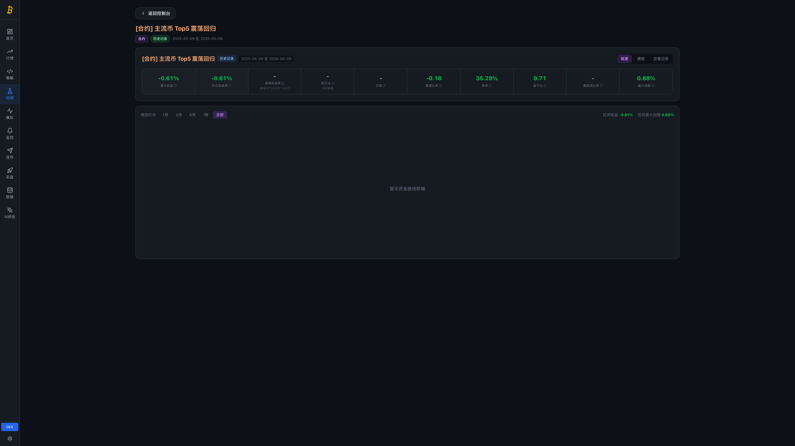

*图09 - 回测历史详情。来源：生产路由 `/backtest`，5120×2880 PNG。*
回测详情页展示总收益、最大回撤、胜率、盈亏比、基准收益、阿尔法和曲线。策略收益曲线、基准曲线、相对收益和回撤应保持颜色、图例和 tooltip 语义一致。

基准收益统一使用 BTC/USDT 的 1D close-to-close 区间收益，不是最近任意 1000 根，也不是策略首个 feed symbol 或随意等权篮子。阿尔法/基准超额是策略累计收益减去同区间 BTC/USDT 基准收益。若基准数据缺失，应留空或提示，不应画合成曲线。

## 页面单元 29：回测成交明细：历史成交价与开仓未平

*图09 - 回测历史详情。来源：生产路由 `/backtest`，5120×2880 PNG。*
成交明细表展示回测期间完成的订单填充，价格是历史模拟执行价，可能已包含滑点，不是当前市场价。表格通常按最新成交在前展示，便于快速检查最后阶段的交易行为。

胜率和盈亏比按闭合 round-trip 交易计算；回测结束时仍未平仓的条目可以展示在成交表中，但不应被误计为已闭合胜负。分析策略时应同时看成交分布、持仓时间和是否存在单笔大亏。

## 页面单元 30：回测失败处理：缺数据与真实 K 线原则

*图07 - 回测控制台。来源：生产路由 `/backtest`，5120×2880 PNG。*
BitPro 回测必须使用真实 K 线。数据读取顺序通常是文件 K 线存储、旧 SQLite 兼容表、低频 OKX 拉取/缓存尝试。如果请求范围仍缺数据，应返回具体缺失交易对和区间，而不是换标的、缩短区间或生成 synthetic bars。

看到失败时先检查数据管理中心，并用自定义同步补齐对应交易对/周期/日期。只有数据覆盖确认后，回测指标才有解释意义。

## 页面单元 31：模拟控制台：Paper 实例管理

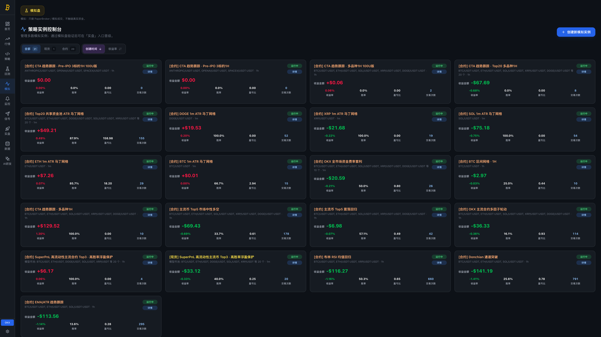

*图10 - 模拟实例控制台。来源：生产路由 `/live`，5120×2880 PNG。*
模拟控制台展示正在运行、暂停或停止的 paper 策略实例。页面支持资产类型筛选、状态筛选、收益排序和创建新实例。每张实例卡片展示策略名、状态、收益、交易数、交易对等摘要。

这里是默认运行入口。创建模拟实例不会触碰真实交易所账户，所有资金和仓位来自 paper broker。操作者可以从策略中心跳转到模拟，也可以直接在模拟页点击创建。

## 页面单元 32：模拟创建向导：运行参数与飞行检查

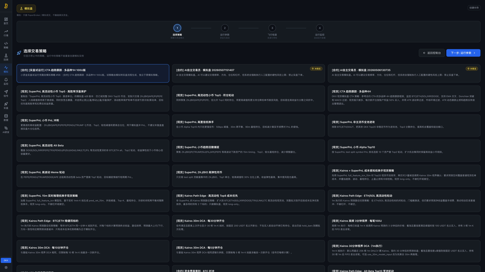

*图11 - 模拟创建向导。来源：生产路由 `/live`，5120×2880 PNG。*
模拟创建向导负责把策略定义变成一个运行实例。向导会显示策略选择、运行参数、初始资金、模式和预检信息。策略定义中的交易范围和执行周期通常是只读信息，启动参数只调整模拟资金、运行风控和通用运行选项。

默认启动设置应保持 paper 模式、OKX 市场数据、策略自带 timeframe、初始资金和循环间隔。启动前确认策略标的、周期和数据预热条件，避免实例一启动就因缺数据进入 error。

## 页面单元 33：模拟实例详情：顶部 KPI 与核心逻辑

*图12 - 模拟实例详情顶部。来源：生产路由 `/live`，5120×2880 PNG。*
实例详情顶部展示账户总额、可用余额、累计收益、浮动盈亏、胜率、盈亏比、交易数和运行状态等 KPI。下方的核心逻辑区复用策略详情中的选股与交易逻辑，帮助把当前指标和策略设计对应起来。

看详情时先判断状态是否 running，再看收益是否来自已实现还是未实现，最后结合持仓和成交解释 KPI。暂停或停止的实例仍应能从持久化记录重建核心指标。

## 页面单元 34：持仓与成交：从 Paper 状态审计执行

*图13 - 模拟实例详情持仓成交。来源：生产路由 `/live`，5120×2880 PNG。*
持仓区域展示当前 symbol、方向、数量、开仓价、标记价、浮动盈亏、强平价或保证金等信息；成交区域展示历史买卖、开平仓、手续费和 PnL。它们是检查策略是否按预期执行的核心证据。

如果收益异常，应从成交倒查：是否出现过度交易、重复开仓、无法平仓、低于最小名义金额跳过、手续费过高或合约方向错误。持仓没有成交支撑时，应检查 broker 状态恢复和持久化记录。

## 页面单元 35：诊断日志：策略事件与故障定位

*图13 - 模拟实例详情持仓成交。来源：生产路由 `/live`，5120×2880 PNG。*
诊断日志记录策略初始化、数据预热、信号跳过、风控拒绝、下单结果和异常。高质量策略应把“不交易”的理由也写入日志，例如趋势过滤未通过、成本后无净边际、模型不可用、资金不足或仓位达到上限。

故障定位顺序建议为：先看页面状态和最近事件，再看诊断日志中的错误栈或中文失败原因，随后检查数据管理和策略配置。对于 AI 自主交易，日志还应包含 AI 决策、风险拒绝和 hold 原因。

## 页面单元 36：监控中心：组合 KPI 与运行面板

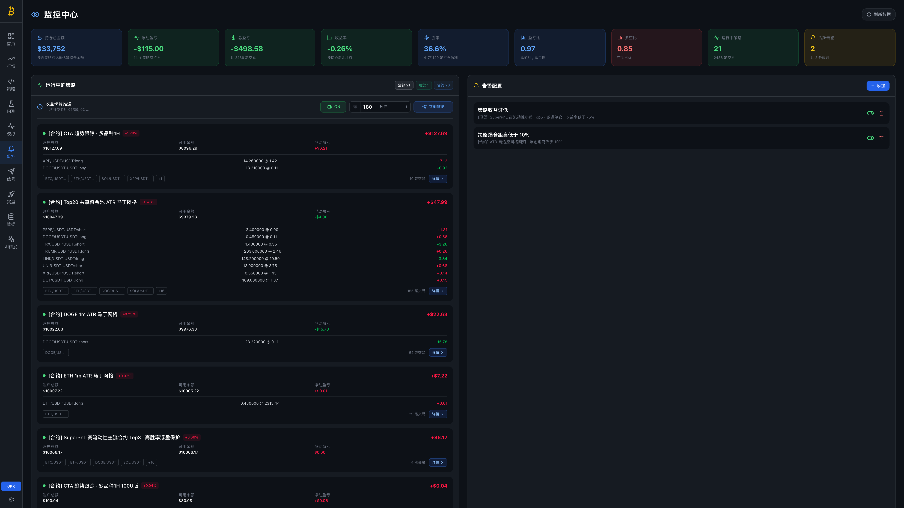

*图14 - 监控中心总览。来源：生产路由 `/monitor`，5120×2880 PNG。*
监控中心跨策略汇总运行状态。顶部 KPI 包括持仓名义、浮动盈亏、总盈亏、总收益率、胜率、盈亏比、多空比例、运行策略数和活跃告警等。下方展示每个运行策略的收益卡片和可进入详情的操作。

该页面适合日常值守。与模拟详情相比，监控中心更关注组合层面和异常提醒；与首页相比，它只看运行策略和账户/风险状态。

## 页面单元 37：运行策略卡片：收益、仓位与跳转

*图14 - 监控中心总览。来源：生产路由 `/monitor`，5120×2880 PNG。*
运行策略卡片展示策略名称、收益率、PnL、账户总额、可用余额、浮动盈亏、交易对标签和交易数。卡片不展示交易所 badge，避免把 paper 运行误读为真实账户。点击详情可以跳转到对应模拟实例监控。

使用时重点比较策略间的收益来源和风险暴露：高收益但浮亏大、胜率高但盈亏比低、交易数异常过多，都需要进一步打开详情查看成交和日志。

## 页面单元 38：收益卡片推送：Feishu/通知配置

*图14 - 监控中心总览。来源：生产路由 `/monitor`，5120×2880 PNG。*
监控中心可以配置运行策略收益卡片推送。操作者可设置间隔分钟数，也可以手动发送一张用于验证。当前设计把收益卡片作为独立 push kind 控制，不等同于全局 Feishu 开关；没有有效 Webhook 时，发送按钮应禁用并显示原因。

推送内容应与监控 KPI 和运行策略卡片一致，包含账户总额、收益、浮盈、持仓、交易数等，不应额外启动、停止或修改策略。若图片模式不可用，可回退到互动卡片。

## 页面单元 39：告警创建：场景模板与阈值

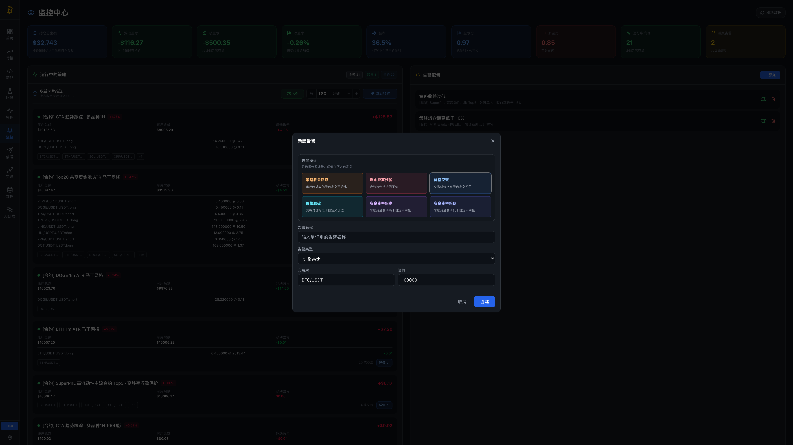

*图15 - 监控告警创建弹窗。来源：生产路由 `/monitor`，5120×2880 PNG。*
告警弹窗支持按运行策略创建收益回撤、爆仓距离、价格突破、价格跌破、资金费率偏高/偏低等场景。模板会填充告警类型、名称和部分默认项，但阈值仍由操作者输入。

告警只读取当前策略状态和市场信息，不改变策略生命周期。收益回撤告警关注 `return_pct`，合约爆仓距离告警关注标记价到强平价距离。为避免噪音，应设置合理 cooldown。

## 页面单元 40：信号中心：通道、策略与信号列表

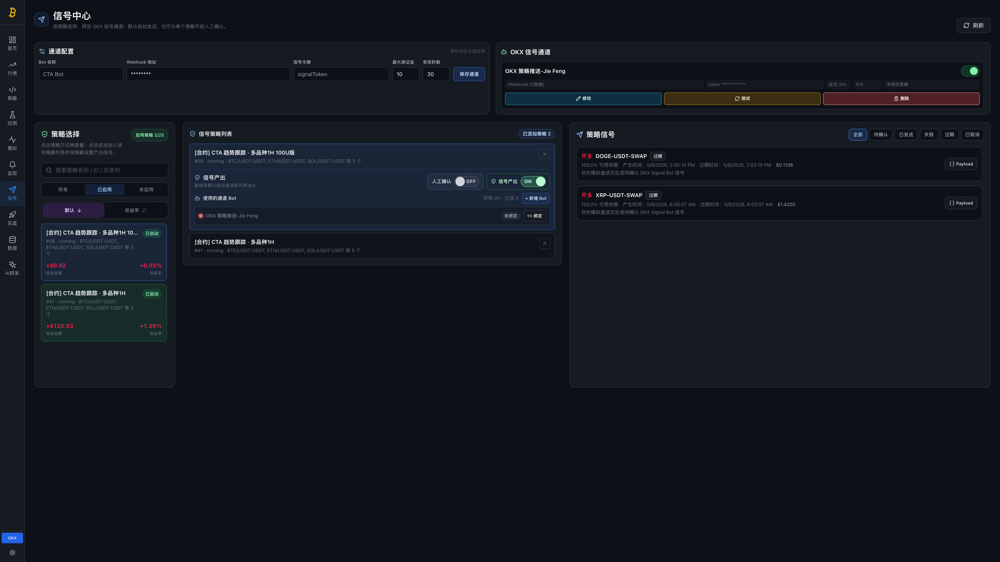

*图16 - 信号中心总览。来源：生产路由 `/signals`，5120×2880 PNG。*
信号中心负责把策略产生的外部执行意图组织成可审计流程。页面通常分为 OKX Signal Bot 通道配置、信号策略列表和信号队列。策略必须显式启用信号产出，通道也必须启用，才可能真实发送。

信号中心不是默认下单通道。它更像一个带人工审核、payload 预览、失败重试和取消能力的发信工作台。未启用或需要人工确认时，信号会停留在待确认状态。

## 页面单元 41：OKX Signal Bot 通道配置

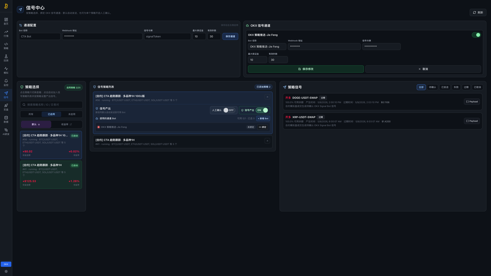

*图17 - 信号通道编辑。来源：生产路由 `/signals`，5120×2880 PNG。*
通道配置包含名称、Webhook、signalToken、适用市场、默认投资类型、默认比例/金额和启用开关。Webhook 和 token 是敏感字段，页面和截图应只显示掩码或脱敏占位；替换 token 时才输入新值。

测试通道时应区分“生成测试 payload”和“真实发送”。产品中的测试按钮可能仅生成 payload，未启用通道时不会真实发送；实际发送需要通道启用、策略启用、信号状态允许且人工确认条件满足。

## 页面单元 42：信号策略列表：启用、确认与路由

*图16 - 信号中心总览。来源：生产路由 `/signals`，5120×2880 PNG。*
信号策略列表把运行策略和信号通道连接起来。每个策略可以开启或关闭信号产出，设置是否需要人工确认，选择默认通道、投资方式、建议比例和有效期。

启用策略前应确认它是合适的外部执行候选：策略状态稳定、信号方向明确、标的与 OKX Bot 匹配、payload 风险注释清楚。对于高风险或新策略，应开启人工确认。

## 页面单元 43：Payload 预览：OKX 自定义 JSON 审计

*图18 - 信号 Payload 区域。来源：生产路由 `/signals`，5120×2880 PNG。*
信号详情展开后会展示 OKX payload preview，包括动作、instrument、价格、建议投资类型、有效期和可选风险说明。操作者应在确认前检查 payload 是否与策略意图一致，尤其是多空方向、合约标识、金额类型和过期时间。

payload 是发往外部 Bot 的关键证据。失败信号可重试，待确认或失败信号可取消；已经成功送达的信号应通过 delivery 记录追踪通道状态和响应码。

## 页面单元 44：人工确认、重试与取消

*图18 - 信号 Payload 区域。来源：生产路由 `/signals`，5120×2880 PNG。*
需要人工确认的信号会保持 pending approval，操作者选择通道后点击确认才会发送。失败信号可以重试，待确认或失败信号可以取消。取消应作为审计动作保留，而不是直接删除信号历史。

使用人工确认时建议建立检查清单：策略状态是否 running、信号是否未过期、标的是否在允许列表、金额是否符合风控、通道是否启用、payload 是否没有敏感明文。

## 页面单元 45：实盘工作台：显式确认的 Live 边界

*图19 - 实盘工作台总览。来源：生产路由 `/live-real`，5120×2880 PNG。*
实盘工作台用于直接 OKX Trade API 试运行，和默认模拟盘严格分离。页面包括账户区、实盘策略列表、预检结果、部署状态、持仓、挂单和历史订单。进入这里不代表已经下单；真实操作需要账户、策略绑定、预检通过和部署确认。

说明书强调：实盘功能只面向明确授权和理解风险的操作者。paper 策略不会因为出现在实盘工作台就自动变成实盘，部署会克隆独立的 `[实盘试运行]` 策略。

## 页面单元 46：实盘账户管理：新增与掩码展示

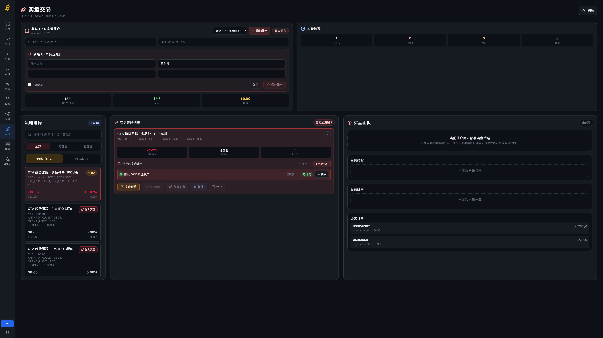

*图20 - 实盘新增账户弹窗。来源：生产路由 `/live-real`，5120×2880 PNG。*
账户管理区域支持新增 OKX 实盘账户，字段包括账户名称、API Key、Secret、Passphrase 和是否 testnet。前端不应回显明文 secret，截图必须遮挡 API Key、账户标识和余额。

新增账户后，页面会按选中账户读取余额、持仓、挂单和历史订单。多个账户之间应独立路由，非默认账户通过独立 exchange alias 懒加载。若密钥权限不足，预检会失败并在日志中显示具体检查项。

## 页面单元 47：实盘策略绑定：从 Paper 策略到候选列表

*图21 - 实盘策略绑定区。来源：生产路由 `/live-real`，5120×2880 PNG。*
实盘策略列表中展示可加入、已加入、已绑定或已部署的策略。操作者需要先把 paper 策略加入实盘候选，再绑定一个或多个实盘账户。绑定是策略与账户的关系，不会自动部署。

后端会从持久化工作台状态恢复已加入或已绑定策略，即使服务重启初期策略解析器暂不可用，也应保留这些行并标记不可部署。未加入且不可解析的策略会隐藏，避免误操作。

## 页面单元 48：实盘预检：权限、配置和风险检查

*图21 - 实盘策略绑定区。来源：生产路由 `/live-real`，5120×2880 PNG。*
实盘预检在策略卡片内触发，结果通过旁边的预检结果按钮和弹出日志展示。预检应检查账户绑定、API 权限、交易对、策略配置、风险参数、可部署性和必要的 live confirmation 条件。

预检失败不会部署策略。失败日志应显示中文原因，例如缺少绑定、权限不足、策略不可解析或配置冲突。成功预检也只是进入部署前状态，仍需要操作者确认部署动作。

## 页面单元 49：实盘部署面板：试运行克隆、持仓与订单

*图19 - 实盘工作台总览。来源：生产路由 `/live-real`，5120×2880 PNG。*
部署后，右侧实盘面板展示独立 live trial 策略、运行状态、当前持仓、当前挂单和历史订单。未部署时，面板应显示空状态，而不是把中间列表的 paper 源策略误认为实盘策略。

部署通常会复制 paper 策略配置并写入实盘账户维度信息，形成独立 `[实盘试运行]` 行。暂停、停止、撤单等动作都应作用于当前账户绑定的实盘实例，不应影响原 paper 策略。

## 页面单元 50：实盘审计与脱敏要求

*图19 - 实盘工作台总览。来源：生产路由 `/live-real`，5120×2880 PNG。*

*图20 - 实盘新增账户弹窗。来源：生产路由 `/live-real`，5120×2880 PNG。*
任何与实盘相关的截图、文档和日志都需要轻度脱敏：API Key、Secret、Passphrase、Webhook、token、账户 id、实盘余额和私有订单标识不得明文出现。页面可以保留结构、按钮、状态和字段名，以便说明用法。

排查实盘问题时优先读取服务端受控日志和只读状态，不在文档中粘贴密钥、完整 URL 或账户号。若需要共享截图，先确认余额和标识已经遮挡。

## 页面单元 51：AI策略助手总览：三个主工作流

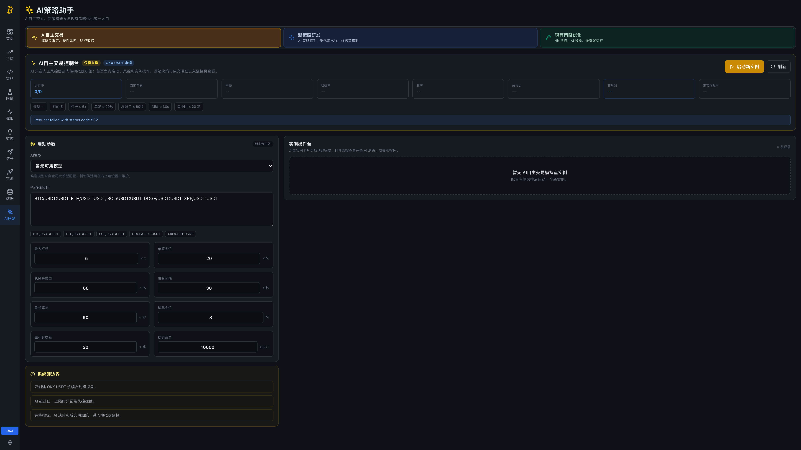

*图25 - AI 自主交易。来源：生产路由 `/ai-lab?tab=autonomous`，5120×2880 PNG。*
AI策略助手包含三个入口：AI自主交易、新策略研发、现有策略优化。默认进入 AI自主交易，另外两个可通过 Tab 或 URL 参数切换。三个入口颜色不同，用于快速区分工作流：自主交易偏运行，研发偏生成，优化偏改良。

AI 输出始终是研究辅助。AI 生成代码必须经过安全沙箱、回测和人工接受；AI 自主交易也只能创建 paper 合约模拟实例，不得默认启动真实资金。

## 页面单元 52：AI自主交易：Paper-only 合约研究

*图25 - AI 自主交易。来源：生产路由 `/ai-lab?tab=autonomous`，5120×2880 PNG。*

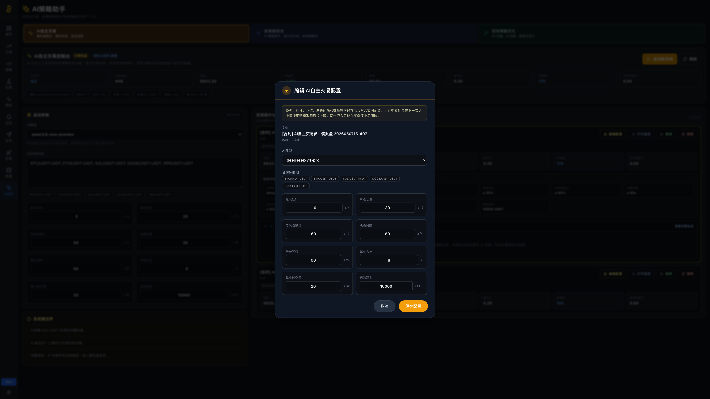

*图26 - AI 自主交易编辑配置。来源：生产路由 `/ai-lab?tab=autonomous`，5120×2880 PNG。*
AI自主交易会启动注册的 `ai_autonomous_trader` 策略，创建 `[合约]` OKX USDT 永续 paper 实例。操作者配置合约标的池、初始模拟资金、最大杠杆、单仓上限、总暴露、最小决策间隔、最大等待、每小时交易上限和探针仓位。

AI 可以建议动作、频率和风险，但必须被硬风控 envelope 约束。超出杠杆、仓位或频率上限的建议应被拒绝并写入中文事件日志；每一次 hold、风险拒绝和成交都应可审计。

## 页面单元 53：AI自主交易配置：模型与硬风控

*图26 - AI 自主交易编辑配置。来源：生产路由 `/ai-lab?tab=autonomous`，5120×2880 PNG。*
配置弹窗允许更新运行实例的 AI 模型和硬风控参数。运行中的实例可以在下一次 AI 决策时应用模型和风险 envelope 变更；初始模拟资金通常只能在停止后调整，避免破坏账户历史一致性。

模型选择来自全局 LLM 候选列表，浏览器不保存独立 API Key。配置应避免暴露固定 K 线周期给模型；运行时可以内部使用观察 feed，但给模型的上下文保持 timeframe-free，让 AI 自行选择观察窗口。

## 页面单元 54：AI 新策略研发：从假设到候选策略

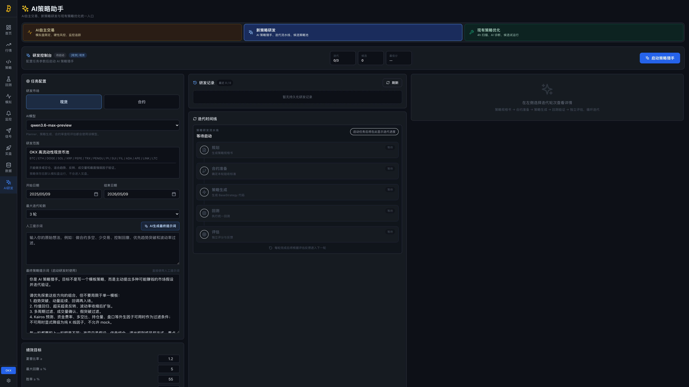

*图27 - AI 新策略研发。来源：生产路由 `/ai-lab?tab=research`，5120×2880 PNG。*
新策略研发使用 AI Planner/Strategist、真实数据回测和 evaluator 循环探索策略假设。操作者可选择现货或合约市场，系统应使用高流动性市场宇宙，而不是只围绕单一交易对生成过拟合策略。

生成策略必须继承当前 BaseStrategy 合同，现货使用 buy/sell，合约使用 open_contract/close_contract/get_contract_position。生成代码要经过安全检查、统一 Backtrader 回测和人工接受，接受后才保存为可运行策略。

## 页面单元 55：AI 研发任务状态：迭代、评分与保存

*图27 - AI 新策略研发。来源：生产路由 `/ai-lab?tab=research`，5120×2880 PNG。*
AI 研发任务会持久化阶段、所选模型、Planner spec、迭代代码、回测指标、evaluator 评分和最佳候选。服务重启时，进行中的任务应标记 interrupted 或按剩余迭代恢复，不应假装仍在运行。

保存候选前应检查：策略名是否有资产前缀，代码是否使用当前接口，回测是否真实数据，交易频率和成本是否合理，是否包含明确退出规则。保存后仍建议先模拟运行，不直接进入外部信号或实盘。

## 页面单元 56：现有策略优化：Paper 策略的改良闭环

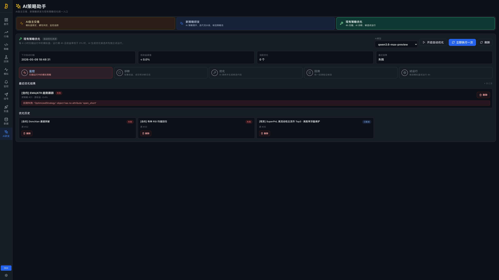

*图28 - AI 现有策略优化。来源：生产路由 `/ai-lab?tab=optimizer`，5120×2880 PNG。*
现有策略优化会扫描正在运行且满足时长条件的 paper 策略，选择表现较差的源策略，让 AI 尝试改良参数或代码。优化候选通过 BaseStrategy 沙箱和统一回测后，会作为独立 paper 策略启动试运行。

优化流程不应覆盖源策略代码、不删除源策略、不清空源指标，也不自动改成实盘。只有候选经过 4 小时等验证窗口且收益改善后，系统才可暂停源策略。这样可以保留审计路径和回滚余地。

## 页面单元 57：AI 模型、API Key 与无 mock 原则

*图25 - AI 自主交易。来源：生产路由 `/ai-lab?tab=autonomous`，5120×2880 PNG。*
AI 相关功能共用全局 LLM 候选模型管理，API Key 保留在服务端环境或受控配置中，前端只选择模型名。市场预测路径必须使用真实 Kairos/SuperPnL 等模型，依赖缺失时应报错并跳过，不允许生成 dummy、random-walk 或 synthetic 预测。

这个原则影响策略、回测和说明书：任何看起来像预测的结果都必须能追溯到真实模型或明确标记为失败。用假数据补成功会污染回测和模拟判断。

## 页面单元 58：端到端操作剧本：从想法到监控

*图01 - 首页行情总览。来源：生产路由 `/`，5120×2880 PNG。*

*图04 - 策略中心列表。来源：生产路由 `/strategy`，5120×2880 PNG。*

*图10 - 模拟实例控制台。来源：生产路由 `/live`，5120×2880 PNG。*

*图14 - 监控中心总览。来源：生产路由 `/monitor`，5120×2880 PNG。*
推荐操作剧本如下：第一，在首页和行情页观察市场；第二，在数据管理补齐目标标的和周期；第三，在策略中心选择或创建策略；第四，在回测控制台验证多个历史区间；第五，在模拟控制台启动 paper 实例；第六，在实例详情和监控中心观察持仓、成交、收益和日志；第七，如需外部执行，只在信号中心或实盘工作台走显式审核流程。

每一步都应产出可审计证据：数据覆盖、策略逻辑、回测指标、模拟成交、诊断日志、告警记录和人工确认。

## 页面单元 59：日常巡检清单

*图14 - 监控中心总览。来源：生产路由 `/monitor`，5120×2880 PNG。*
每日巡检建议按固定顺序执行：检查首页和行情连通性；查看数据同步是否有失败任务；打开监控中心看运行策略数、总收益、浮动盈亏和告警；抽查收益最高和最低的策略详情；检查信号中心是否有待确认或失败信号；若有实盘试运行，查看预检、挂单、持仓和订单历史。

巡检记录应包含异常策略 id、时间、页面截图或日志摘要、处理动作和是否需要回滚。不要只记录最终收益，忽略数据和执行异常。

## 页面单元 60：故障排查路径：页面、API、数据、策略

*图13 - 模拟实例详情持仓成交。来源：生产路由 `/live`，5120×2880 PNG。*
常见故障可按四层定位。页面层看按钮、空状态、筛选和浏览器请求；API 层看接口返回和错误 message；数据层看 K 线覆盖、同步任务和数据源；策略层看 on_bar 日志、broker 拒绝原因和持久化成交。

例如“策略不交易”可能是无数据、未预热、信号未通过、仓位达到上限、余额不足、合约 metadata 缺失、AI 模型失败或风控拒绝。逐层排查比直接修改策略参数更可靠。

## 页面单元 61：文档维护与截图复采规则

*图01 - 首页行情总览。来源：生产路由 `/`，5120×2880 PNG。*
当产品页面结构、策略执行合同、信号 payload、实盘预检或 AI 流程发生变化时，应同步更新本说明书和 CAPTURE 记录。截图复采必须继续使用生产地址普通导航，记录时间、路由、视口、DPR、脱敏方式和文件清单。

截图不能用 mock、拦截请求、DOM 注入或截图专用假数据。若飞书单图大小受限，应拆分长页面或减少一次插入数量，而不是大幅压缩导致字段不可读。

## 页面单元 62：复盘中心：运行策略的小时级复盘

> 生产截图待按单元 61 复采规则采集；权威设计文档见 `docs/pages/复盘中心.md`。

复盘中心（`/review`）回答"现在跑着的模拟策略最近表现怎么样、为什么"。页面调用 `GET /api/v2/review/summary`，按窗口（默认 24h、可切 7d 等）和小时桶聚合运行中 paper 策略的收益、回撤和成交质量，输出分层评分榜单、表现最好/最差列表和收益热力图，并给出结论标签（如趋势贡献、成本拖累）。

使用要点：

- 评分只统计窗口内有真实权益采样和成交的策略；数据不足的策略显式标注，不补假分。
- 从榜单可以直接跳转到对应模拟实例详情做逐笔核对。
- 复盘结论是研究参考，不构成调仓指令；调整参数后应回到回测和模拟盘重新验证。

## 页面单元 63：盯盘：账户持仓标的行情跟踪

> 生产截图待采集；权威设计文档见 `docs/pages/盯盘.md`。

盯盘页（`/watch`）面向"已经持有仓位的标的怎么看"。操作者先选择一个已绑定的 OKX 或 Binance USD-M 账户，页面读取该账户真实持仓与近期执行记录（`live_signal_executions`），把持仓相关标的组织成行情卡片和 K 线买卖点视图，支持移动端浏览。

使用要点：

- 只读诊断：盯盘不下单、不改仓位；私有数据读取走所选账户的只读权限。
- 标的集合来自真实持仓与执行记录，不是手工自选列表。
- K 线与盘口来自交易所公开 API，与行情页共用缓存。

## 页面单元 64：链上研究：DeFiLlama 链上看板

> 生产截图待采集；权威设计文档见 `docs/pages/链上研究.md`。

链上研究（`/onchain`）把 DeFiLlama 公开数据聚合成投资研究视角：链 TVL 与变化、协议 TVL 榜单、协议费用、稳定币供给和稳定币收益池。数据经 `/api/v2/onchain/summary` 服务端聚合并附数据源健康与风险提示。

使用要点：

- 该页是宏观/板块研究辅助，不直接产生交易信号。
- DeFiLlama 数据有延迟和口径差异，页面会显式提示数据源状态；拉取失败显示真实错误而不是占位数字。
- 链上观察转化为策略假设时，仍需回到数据中心同步、回测和模拟盘流程验证。

## 页面单元 65：因子库：FactorLab 因子目录与 ML 验证

> 生产截图待采集；权威设计文档见 `docs/pages/因子库.md`。

因子库（`/factorlab`）是 FactorLab 的只读因子目录加研究任务工作台：左侧展示十六个内置连续因子定义（含成交量家族）、稳定参数实例和实现哈希；右侧提供手动/自动/混合组合的研究任务配置（市场、周期、日期、Provider、模型、思考深度、速度和预算），以及任务/Trial 台账与暂停、恢复、软归档操作。

边界要点：

- 研究结果只形成不可交易候选，不自动创建 Paper/Live 实例。
- 后台最多并发 2 个研究 runner，超大数据集在创建时直接拒绝。
- Provider 只接收脱敏目录并返回严格结构化组合，不做 tool calling；独立 research gateway 未实现。

## 页面单元 66：套利中心：跨所机会与净优势计算

> 生产截图待采集；权威设计文档见 `docs/pages/套利中心.md`。

套利中心（`/arbitrage` 直达路由，不在侧边栏）服务跨所价差研究：OKX + Binance USD-M 的资金费率榜、机会列表、价差矩阵、净优势计算器（双腿开平成本后的净优势对比），以及组合持仓、腿状态、净敞口和实际盈亏拆解；首页费率榜承载日常费率浏览。

边界要点：

- 默认 read/research/backtest/paper only；真实跨所下单、划转和再平衡不在当前范围。
- 每个机会必须展示手续费、滑点、深度、资金费和净优势拆解，缺数据显式空态。
- 内置跨所套利 seed 是 paper 候选，净优势为研究投影字段，不是收益承诺。

## 页面单元 67：自主研究：ARC 控制台

> 生产截图待采集；权威设计文档见 `docs/pages/自主研究.md`。

自主研究（`/arc`）是 ARC 控制台：以任务（mission）为单位组织 AI 辅助研究流程，展示任务进度、证据收集和研究决策入口，配置来自 `/api/v2/arc/config`。它把 AI 参与度限制在研究与证据整理层面，产出物进入同一套人工审阅链路，不绕过策略命名、paper 默认和实盘确认边界。

## 附录 A：关键术语

- Paper / Simulation：使用真实市场数据和模拟账户状态运行策略，不读取真实账户余额、持仓或订单。
- Backtest：使用真实历史 K 线对策略逻辑进行历史验证，指标不代表未来收益。
- Signal：策略产生的外部执行意图，需要通道、策略启用和可选人工确认后才可能发送。
- Live Trial：显式确认后的独立实盘试运行克隆，和 paper 源策略分离。
- BaseStrategy：BitPro 统一策略执行接口，策略通过 on_bar 接收 K 线并调用 broker API。

## 附录 B：高清截图文件清单

- 图01：`screenshots/01-home-overview.png`，5120×2880，0.57 MB，首页行情总览
- 图02：`screenshots/02-market-kline-orderbook.png`，5120×2880，0.67 MB，行情 K 线与订单簿
- 图03：`screenshots/03-market-timeframes.png`，5120×2880，0.64 MB，行情周期切换区
- 图04：`screenshots/04-strategy-center.png`，5120×2880，1.21 MB，策略中心列表
- 图05：`screenshots/05-strategy-detail.png`，5120×2880，0.25 MB，策略详情页
- 图06：`screenshots/06-strategy-create-modal.png`，5120×2880，0.39 MB，新建策略弹窗
- 图07：`screenshots/07-backtest-console.png`，5120×2880，0.28 MB，回测控制台
- 图08：`screenshots/08-backtest-create-wizard.png`，5120×2880，0.34 MB，回测创建向导
- 图09：`screenshots/09-backtest-history-detail.png`，5120×2880，0.21 MB，回测历史详情
- 图10：`screenshots/10-live-console.png`，5120×2880，0.55 MB，模拟实例控制台
- 图11：`screenshots/11-live-create-wizard.png`，5120×2880，1.23 MB，模拟创建向导
- 图12：`screenshots/12-live-instance-detail-top.png`，5120×2880，1.23 MB，模拟实例详情顶部
- 图13：`screenshots/13-live-instance-detail-lower.png`，5120×2880，1.47 MB，模拟实例详情持仓成交
- 图14：`screenshots/14-monitor-overview.png`，5120×2880，0.61 MB，监控中心总览
- 图15：`screenshots/15-monitor-alert-modal.png`，5120×2880，0.60 MB，监控告警创建弹窗
- 图16：`screenshots/16-signals-overview.png`，5120×2880，0.48 MB，信号中心总览
- 图17：`screenshots/17-signals-channel-edit.png`，5120×2880，0.50 MB，信号通道编辑
- 图18：`screenshots/18-signals-signal-detail.png`，5120×2880，0.48 MB，信号 Payload 区域
- 图19：`screenshots/19-live-real-overview.png`，5120×2880，0.52 MB，实盘工作台总览
- 图20：`screenshots/20-live-real-add-account.png`，5120×2880，0.52 MB，实盘新增账户弹窗
- 图21：`screenshots/21-live-real-strategy-binding.png`，5120×2880，0.50 MB，实盘策略绑定区
- 图22：`screenshots/22-data-overview.png`，5120×2880，0.33 MB，数据管理中心
- 图23：`screenshots/23-data-sync-modal.png`，5120×2880，0.91 MB，同步配置弹窗
- 图24：`screenshots/24-data-add-symbol-modal.png`，5120×2880，0.91 MB，增加交易对弹窗
- 图25：`screenshots/25-ai-autonomous.png`，5120×2880，0.64 MB，AI 自主交易
- 图26：`screenshots/26-ai-autonomous-config.png`，5120×2880，0.70 MB，AI 自主交易编辑配置
- 图27：`screenshots/27-ai-research.png`，5120×2880，0.64 MB，AI 新策略研发
- 图28：`screenshots/28-ai-optimizer.png`，5120×2880，0.36 MB，AI 现有策略优化
